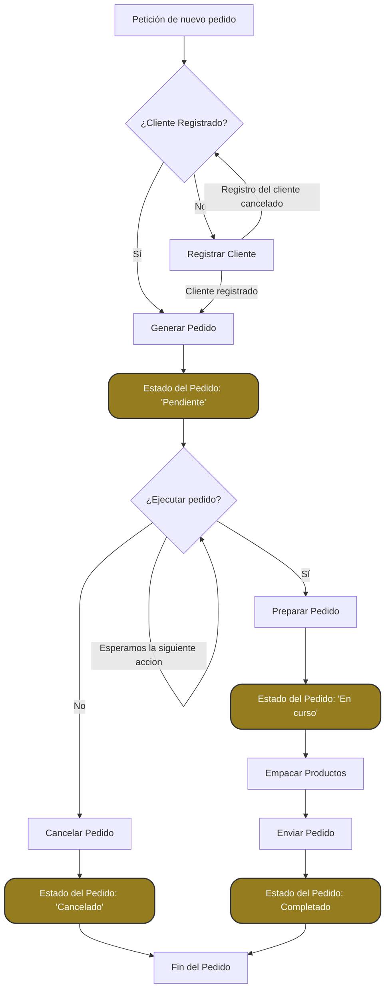

# ¿Cómo funciona el sistema de pedidos?

Cada pedido tiene asociado el nombre del cliente que realiza el pedido, un número de referencia que identifica el pedido, asi como el usuasrio que crea el pedidio (este usuario puede ser tanto un empleado que tenga el rol adecuado como el propio cliente)

los pedidios los crea un cliente y estos llegan al departamento de ventas y pedidos. Este departamento es quien pasas el pedido al sistema de gestión del almacen

# Proceso de Pedido

Este documento describe el flujo de un pedido desde su inicio hasta su finalización.

### 1. **Inicio del Pedido: Petición de nuevo pedido**

El proceso comienza cuando un usuario decide insertar un pedido en el sistema.

### 2. **¿Cliente Registrado?**

El sistema verifica si el cliente está registrado en la base de datos del almacen.

#### 2.1. **Sí: Cliente Registrado**

Si el cliente está registrado, puede proceder a seleccionar los productos.

#### 2.2. **No: Registrar Cliente**

Si el cliente no está registrado, se realiza el proceso automático de registro del cliente

### 3. **Generar Pedido**

Una vez confirmamos el registro del cliente, el sistema genera un pedido con los detalles del cliente y los productos seleccionados.

### 4. **Estado del Pedido: Pendiente**

El pedido se marca como "Pendiente" mientras se espera la ejecución del pedido.

### 5. **¿Empezamos a ejecutar el pedido?**

Si emepzamos a tramitar el pedido

#### 5.1. **Sí: Empezamos a ejecutar el pedido**

El pedido pasa al siguiente estado: "Preparar Pedido" -> El estado del pedido se actualiza a "En curso".

#### 5.2. **No: Cancelamos el pedido**

el pedido se cancela -> El estado del pedido se actualiza a "Cancelado".

### 6. **Preparar Pedido**

Una vez se empieza a ejecutar el pedidio. Esto incluye verificar la disponibilidad de los productos y su preparación para el envío.

### 7. **Empacar Productos**

Los productos se empacan para su envío. Este paso asegura que los productos estén listos para la entrega.

### 8. **Enviar Pedido**

El pedido es enviado al cliente. Dependiendo del tipo de envío, puede variar el tiempo de entrega.

### 9. **Estado del Pedido: Completado**

Una vez que el pedido ha sido enviado, se marca como "Completado" -> El estado del pedido se actualiza a "Completado"

### 10. **Fin del Pedido**

El proceso del pedido ha finalizado exitosamente.

---

## Diagrama de Flujo del Proceso de Pedido

## Código de referencia

Los códigos de referencia se **generan automaticamente** y presentan el siguiente formato

  <code style="background-color: #222; color: #caa83f; padding: 5px 10px; border-radius: 4px; display: inline-block;">
    PED-YYYYMMDD-HHHHH
  </code>

1. **PED**: Identificador del tipo de registro (pedido).
2. **YYYYMMDD**: Año, mes y día del pedido (por ejemplo, 20241121 para el 21 de noviembre de 2024).
3. **HHHHH**: Código secuencial único en hexadecimal, donde cada nuevo pedido del día tiene su número consecutivo convertido a hexadecimal.

**Ejemplo:** PED-20241121-03E8
