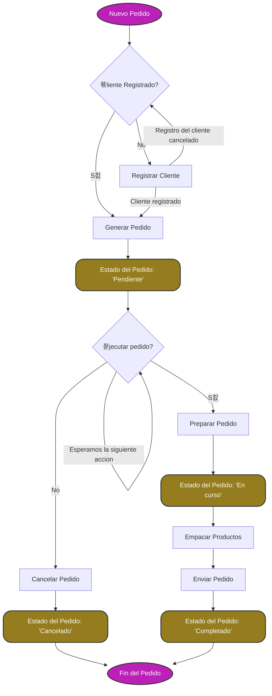

# 쮺칩mo funciona el sistema de pedidos?

Cada pedido tiene asociado el **nombre del cliente** que realiza el pedido, un **número de referencia** que identifica el pedido, asi como el **usuario que crea el pedidio**

los pedidios los crea un cliente y estos llegan al departamento de ventas y pedidos. Este departamento es quien pasas el pedido al sistema de gestión del almacen

# Proceso de Pedido

Este documento describe el flujo de un pedido desde su inicio hasta su finalización.

### 1. **Inicio del Pedido: Petición de nuevo pedido**

El proceso comienza cuando un usuario decide insertar un pedido en el sistema. En el departamento de 'Ventas y Pedidos' los administrativos (rol de 'Administración') generan el pedido

### 2. **쮺liente Registrado?**

El sistema verifica si el cliente está registrado en la base de datos del almacen.

#### 2.1. **Sí: Cliente Registrado**

Si el cliente está registrado, puede proceder a seleccionar los productos.

#### 2.2. **No: Registrar Cliente**

Si el cliente no está registrado, se realiza el proceso de registro del cliente

### 3. **Generar Pedido**

Una vez confirmamos el registro del cliente, el sistema genera un pedido con los detalles del cliente y los productos seleccionados.

### 4. **Estado del Pedido: Pendiente**

El pedido se marca como "Pendiente" mientras se espera la ejecución del pedido.

### 5. **쮼mpezamos a ejecutar el pedido?**

Si emepzamos a tramitar el pedido

#### 5.1. **Sí: Empezamos a ejecutar el pedido**

El pedido pasa al siguiente estado: "Preparar Pedido" -> El estado del pedido se actualiza a "En curso".

#### 5.2. **No: Cancelamos el pedido**

el pedido se cancela -> El estado del pedido se actualiza a "Cancelado".

### 6. **Preparar Pedido**

Una vez se empieza a ejecutar el pedidio. Esto incluye verificar la disponibilidad de los productos y su preparación para el envío.

### 7. **Empacar Productos**

Los productos se empacan para su envío. Este paso asegura que los productos estén listos para la entrega.

### 8. **Enviar Pedido**

El pedido es enviado al cliente. Dependiendo del tipo de envío, puede variar el tiempo de entrega.

### 9. **Estado del Pedido: Completado**

Una vez que el pedido ha sido enviado, se marca como "Completado" -> El estado del pedido se actualiza a "Completado"

### 10. **Fin del Pedido**

El proceso del pedido ha finalizado exitosamente.

---

### Diagrama de Flujo del Proceso de Pedido

## Código de referencia

Los códigos de referencia se **generan automaticamente** y presentan el siguiente formato

  <code style="background-color: #222; color: #caa83f; padding: 5px 10px; border-radius: 4px; display: inline-block;"> PED-YYYYMMDD-HHHHHH </code>

1. **`PED`**: **{Prefijo}** Identificador del tipo de registro (pedido).
2. **`YYYYMMDD`**: Año, mes y día del registro del pedido (por ejemplo, 20241121 para el 21 de noviembre de 2024).
3. **`HHHHHH`**: Código secuencial único en hexadecimal, donde cada nuevo pedido del día tiene su número consecutivo convertido a hexadecimal.

Dado que el código secuencial tiene seis dígitos en formato hexadecimal en un dia podemos hacer la siguiente cantidad de pedidos:

$$
16^6 = 16,777,216 \ \text{pedidos/día}
$$

📚 **Ejemplo:** PED-20241121-0003E8 (En ese día se hicieron 3E8=1000 pedidos)
