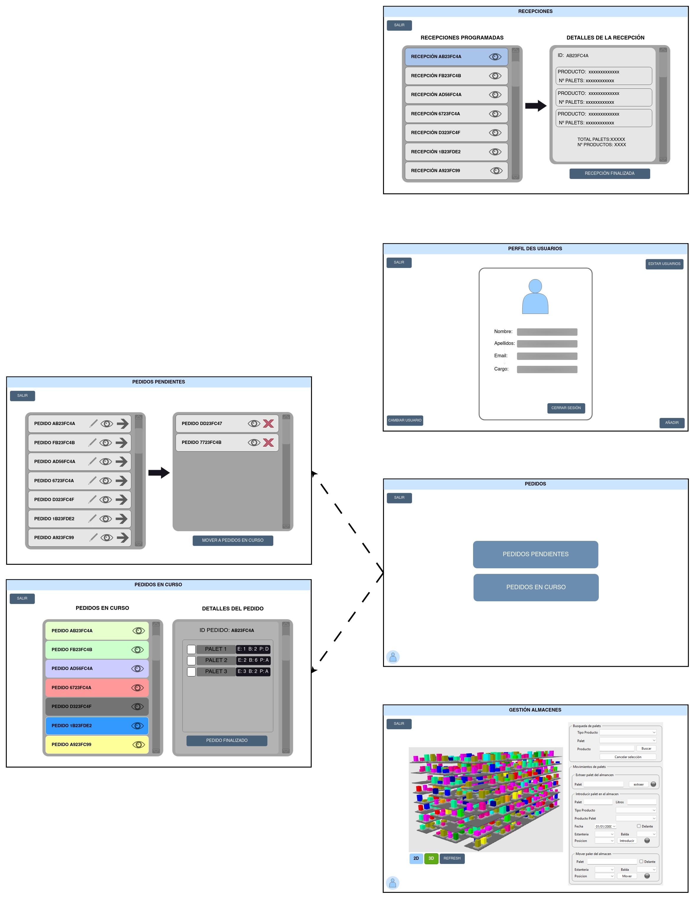
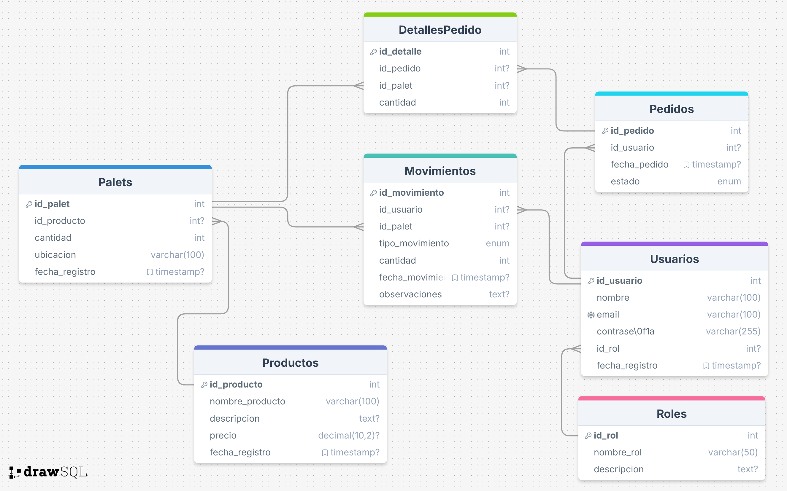

<!-- TO-DO hay que revisar la base de datos -->

<!DOCTYPE html>
<html lang="es">
<head>
    <meta charset="UTF-8">
    <meta name="viewport" content="width=device-width, initial-scale=1.0">
    <title>Matriz de Roles y Permisos</title>
    <link rel="stylesheet" href="styles.css">
</head>
</html>

<h2 align="left" style="font-style: normal; font-size: 15px; margin:0; border-bottom: none;"> Proyecto: TFG EyA-Uvigo-Jose-Torre</h2>

<h2 style="font-style: normal; font-size: 15px; margin:0; border-bottom: none;"> Alumno: Jose Tomas Torre Pedroarena </h2>

<h1 align="center" style="margin: 20px 0 30px 0; font-size:30px; border-bottom: none; text-decoration: underline;">Aplicación de Gestión de Almacenes: Presentación del Proyecto</h1>

Este software pretende ser una aplicación de gestión de un almacen que permita a los operarios realizar los diferentes procesos de almacenamiento y mantenimiento de productos, así como a los administradores y gestores de gestionar el almacén y sus productos.

Para desarrollar un proyecto de gestión de almacenes completo, es esencial incluir un conjunto de características y funcionalidades que cubran tanto las necesidades operativas de los empleados en el almacén (como el movimientos de los palets dentro del almacen, la gestion de los pedidos, etc.) como las de los administradores y gestores (como la gestión de inventario, pedidos, reportes, etc.).

    
     
      
    
 Ejemplos de almacenes reales a gestionar

**1. Gestión de Inventario:**

- Registro de Productos:
- Agregar, editar y eliminar productos.
- Información detallada de los productos: código de barras, nombre, descripción, categoría, proveedor,- precio, unidades en stock, etc.
- Control de Stock:
- Niveles mínimos y máximos de stock.
- Alertas de productos en niveles bajos o agotados.
- Ubicación de Productos en el Almacén:
- Asignar productos a estanterías o zonas específicas del almacén (integrando con la vista 3D que ya tienes).
- Historial de Movimientos:
- Registro de entradas y salidas de productos, devoluciones y transferencias entre almacenes.

**2. Gestión de Pedidos:**

- Recepción de Pedidos (Entradas):
- Crear y gestionar órdenes de compra a proveedores.
- Registro de las entradas de productos al almacén.
- Gestión de Pedidos de Clientes (Salidas):
- Procesar pedidos de clientes, asignar productos y gestionar el picking (preparación de los pedidos).
- Registro del estado de los pedidos (pendiente, preparado, enviado, entregado).

**3. Control de Picking y Packing:**

- Picking Automático:
- Asignar y optimizar la ruta para que los operarios recojan los productos en el almacén, mostrando la ubicación de los mismos.
- Packing:
- Gestión de embalaje y preparación de los pedidos antes del envío.

**4. Gestión de Usuarios y Roles:**

- Control de Acceso:
- Permitir la creación de diferentes roles de usuario (administradores, operarios, supervisores) con- permisos específicos.
- Historial de Acciones:
- Registrar las acciones realizadas por cada usuario (como cambios en el inventario, pedidos gestionados,- etc.) para tener un control y trazabilidad.

**5. Interfaz Móvil para Operarios:**

- Acceso desde Dispositivos Móviles:
- Crear una aplicación móvil o web responsive para que los operarios puedan:
- Consultar inventario en tiempo real.
- Escanear productos usando la cámara del móvil (código de barras o QR).
- Registrar entradas y salidas de productos desde el almacén.
- Notificaciones en Tiempo Real:
- Alertas sobre tareas pendientes (recoger productos, gestionar devoluciones, realizar auditorías, etc.).

**6. Integración con Base de Datos:**

- Conexión a una Base de Datos Centralizada:
  - Usa una base de datos (SQL o NoSQL, según lo que prefieras) para almacenar toda la información del almacén (productos, ubicaciones, usuarios, pedidos, etc.).
  - Sincronización en tiempo real entre la aplicación de escritorio y la aplicación móvil/tablet.
  - Backups y Recuperación de Datos:
  - Implementar un sistema de copias de seguridad y restauración para prevenir pérdida de información crítica.

**7. Informes y Análisis:**

- Generación de Reportes:
  - Informes de ventas, productos más vendidos, productos con mayor rotación, inventario actual, etc.
  - Análisis de Rendimiento:
  - Monitorear el rendimiento del almacén, tiempos de procesamiento de pedidos, eficiencia de los operarios y otros KPIs.
  - Visualización Gráfica:
  - Incluir gráficos de barras, pastel, líneas para visualizar tendencias de inventario y rendimiento.

**8. Funcionalidades Adicionales:**

- Devoluciones y Reclamaciones:
  - Gestionar devoluciones de productos defectuosos o incorrectos y mantener un registro de estos casos.
  - Gestión de Proveedores y Clientes:
  - Base de datos de proveedores y clientes con capacidad de gestionar pedidos de compra y ventas.
  - Control de Mermas: Registrar productos dañados o vencidos y su correcta eliminación del inventario.

~~**9. Seguridad y Auditorías:**~~
~~- Cifrado de Datos:~~
  ~~- Asegurar que la información confidencial (como contraseñas y datos de clientes) esté protegida mediante cifrado.~~
  ~~- Auditoría de Seguridad:~~
    ~~- Implementar un sistema que permita revisar qué cambios han sido realizados por cada usuario y cuándo.~~

**10. Escalabilidad y Extensibilidad:**

- Conexiones a otros Sistemas:
  Si planeas a largo plazo, sería útil dejar abierto un espacio para integrar tu sistema con otros sistemas de ERP o de gestión de logística.
  API:
- Considera el desarrollo de una API para permitir la integración de la aplicación con otros sistemas externos.

<table id="tabla_funciones_a_realizar" style="margin-bottom: 50px;">
    <thead>
        <tr>
            <th>Funcionalidades</th>
        </tr>
    </thead>
    <tbody>
        <tr><td>Gestión de proveedores</td></tr>
        <tr><td>Gestión de clientes</td></tr>
        <tr><td>Gestión de pedidos</td></tr>
        <tr><td>Control de existencias</td></tr>
        <tr><td>Documentos API</td></tr>
        <tr><td>Soporte de aplicaciones Android</td></tr>
        <tr><td><del>Múltiples almacenes</del></td></tr>
        <tr><td><del>Exposición de existencias de seguridad</del></td></tr>
        <tr><td><del>Escáner PDA</del></td></tr>
        <tr><td><del>Soporte de aplicaciones IOS</del></td></tr>
    </tbody>
</table>

<!--
|           IMPLEMENTACIONES             |
| -------------------------------------- |
| Múltiples almacenes                    |
| Gestión de proveedores                 |
| Gestión de clientes                    |
| Escáner PDA                            |
| Conteo de ciclos                       |
| Gestión de pedidos                     |
| Control de existencias                 |
| Exposición de existencias de seguridad |
| Documentos API                         |
| Soporte de aplicaciones IOS            |
| Soporte de aplicaciones Android        |
| Soporte de aplicaciones electrónicas   |
-->

## Esquema de la aplicación de escritorio (Desktop app)

La aplicación de escritorio es la versión más simple de la aplicación, que se encarga de gestionar el almacén en el equipo de operarios. Para su uso será necesario que el empleado se identifique con su usuario y contraseña para asi gestionar los permisos que los diferentes persona tienen, y que esté conectado a internet. Los diferentes usuarios estan descritos en la sección "<a href="#seccion2" style="font-style:italic">Usuarios, Roles y Permisos</a>"

    
    
 Jerarquía de las ventanas principales 

Las ventanas principales que componen la aplicación se muestran son:

- Inicio de sesion
- Ventana principal: elegimos la accion principàl que queremos realizar (gestión del almacen, pedidos, etc.)
- Infomacion del usuario: muestra información sobre el usuario actual asi como los permisos que tiene
- Administracion del almacen: muestra los palets que hay en él con los diferentes productos que hay en cada palet
- Pedidios:
    - Pedidos pendientes: muestra todos los pedidos que se deben realizar pero que ningun operario está ejecutando
    - Pedidos en curso: muestra todos los pedidios que estan ejecutando los operarios

    
    
 Bocetos de las ventanas principales 

La visulización de los almacenes se podrá hacer de dos formas: en `3D` o `2D` según sea necesario.

    
    
 Visualización de los almacenes en 3D y 2D 

## Base de datos

Código de la base de datos en la ruta: `/Presentacion-Proyecto/almacenesBDD.sql`

Entidades clave a considerar:

- **Usuarios** (Administradores, Operarios, Clientes, etc.)
- **Almacenes** (Si gestionas múltiples almacenes)
- **Productos** (Inventario de productos)
- **Proveedores**
- **Clientes**
- **Pedidos** (Pedidos realizados, ya sea de clientes o proveedores)
- **Movimientos de stock** (Entrada y salida de productos)

    
    
 Diagrama de la base de datos (<a href="https://drawsql.app/" style="color: #3498db" >https://drawsql.app/</a>)

**leyenda de los simbolos de las tablas:**

**1. Tabla `Usuarios`**

Esta tabla almacena la información de todos los usuarios que interactúan con la aplicación.

<table class="bdd">
    <thead>
        <tr>
            <th>Campo</th>
            <th>Tipo de dato</th>
            <th>Descripción</th>
        </tr>
    </thead>
    <tbody>
        <tr><td>id_usuario</td><td>INT (PK, AUTO_INCREMENT)</td><td>Identificador único del usuario.</td></tr>
        <tr><td>nombre</td><td>VARCHAR(100)</td><td>Nombre completo del usuario.</td></tr>
        <tr><td>correo</td><td>VARCHAR(150)</td><td>Correo electrónico del usuario (único).</td></tr>
        <tr><td>contraseña</td><td>VARCHAR(255)</td><td>Contraseña encriptada del usuario.</td></tr>
        <tr><td>rol</td><td>ENUM('Admin', 'Operario', 'Cliente')</td><td>Rol del usuario en el sistema.</td></tr>
        <tr><td>estado</td><td>ENUM('Activo', 'Inactivo')</td><td>Estado del usuario.</td></tr>
    </tbody>
</table>

**2. Tabla `Almacenes`**

Si hay múltiples almacenes, esta tabla es esencial.

<table class="bdd">
    <thead>
        <tr>
            <th>Campo</th>
            <th>Tipo de dato</th>
            <th>Descripción</th>
        </tr>
    </thead>
    <tbody>
        <tr><td>id_almacen</td><td>INT (PK, AUTO_INCREMENT)</td><td>Identificador único del almacén.</td></tr>
        <tr><td>nombre</td><td>VARCHAR(100)</td><td>Nombre o código del almacén.</td></tr>
        <tr><td>ubicacion</td><td>VARCHAR(150)</td><td>Dirección o ubicación física del almacén.</td></tr>
        <tr><td>supervisor</td><td>INT (FK)</td><td>Referencia al usuario supervisor del almacén.</td></tr>
    </tbody>
</table>

**3. Tabla `Productos`**

Aquí se almacena toda la información sobre los productos en el inventario

<table class="bdd">
    <thead>
        <tr>
            <th>Campo</th>
            <th>Tipo de dato</th>
            <th>Descripción</th>
        </tr>
    </thead>
    <tbody>
        <tr><td>id_producto</td><td>INT (PK, AUTO_INCREMENT)</td><td>Identificador único del producto.</td></tr>
        <tr><td>nombre</td><td>VARCHAR(100)</td><td>Nombre del producto.</td></tr>
        <tr><td>descripcion</td><td>TEXT</td><td>Descripción detallada del producto.</td></tr>
        <tr><td>codigo_barras</td><td>VARCHAR(50)</td><td>Código de barras del producto (si aplica).</td></tr>
        <tr><td>stock_actual</td><td>INT</td><td>Cantidad actual en stock del producto.</td></tr>
        <tr><td>stock_minimo</td><td>INT</td><td>Cantidad mínima para seguridad de stock.</td></tr>
        <tr><td>precio_compra</td><td>DECIMAL(10, 2)</td><td>Precio de compra del producto.</td></tr>
        <tr><td>precio_venta</td><td>DECIMAL(10, 2)</td><td>Precio de venta del producto.</td></tr>
        <tr><td>id_proveedor</td><td>INT (FK)</td><td>Proveedor principal del producto.</td></tr>
        <tr><td>id_almacen</td><td>INT (FK)</td><td>Almacén donde se encuentra el producto.</td></tr>
    </tbody>
</table>

**4. Tabla `Proveedores`**

Guarda información sobre los proveedores que suministran productos al almacén.

<table class="bdd">
    <thead>
        <tr>
            <th>Campo</th>
            <th>Tipo de dato</th>
            <th>Descripción</th>
        </tr>
    </thead>
    <tbody>
        <tr><td>id_proveedor</td><td>INT (PK, AUTO_INCREMENT)</td><td>Identificador único del proveedor.</td></tr>
        <tr><td>nombre</td><td>VARCHAR(100)</td><td>Nombre de la empresa proveedora.</td></tr>
        <tr><td>contacto</td><td>VARCHAR(100)</td><td>Nombre de la persona de contacto.</td></tr>
        <tr><td>telefono</td><td>VARCHAR(50)</td><td>Número de teléfono del proveedor.</td></tr>
        <tr><td>email</td><td>VARCHAR(150)</td><td>Correo electrónico del proveedor.</td></tr>
    </tbody>
</table>

**5. Tabla `Clientes`**

Información sobre los clientes, en caso de que los almacenes vendan productos a clientes.

<table class="bdd">
    <thead>
        <tr>
            <th>Campo</th>
            <th>Tipo de dato</th>
            <th>Descripción</th>
        </tr>
    </thead>
    <tbody>
        <tr><td>id_cliente</td><td>INT (PK, AUTO_INCREMENT)</td><td>Identificador único del cliente.</td></tr>
        <tr><td>nombre</td><td>VARCHAR(100)</td><td>Nombre del cliente o empresa.</td></tr>
        <tr><td>direccion</td><td>VARCHAR(150)</td><td>Dirección del cliente.</td></tr>
        <tr><td>telefono</td><td>VARCHAR(50)</td><td>Número de teléfono del cliente.</td></tr>
        <tr><td>email</td><td>VARCHAR(150)</td><td>Correo electrónico del cliente.</td></tr>
    </tbody>
</table>

**6. Tabla `Pedidos`**

Los pedidos pueden ser pedidos de clientes o compras a proveedores.

<table class="bdd">
    <thead>
        <tr>
            <th>Campo</th>
            <th>Tipo de dato</th>
            <th>Descripción</th>
        </tr>
    </thead>
    <tbody>
        <tr>
            <td>id_pedido</td>
            <td>INT (PK, AUTO_INCREMENT)</td>
            <td>Identificador único del pedido.</td>
        </tr>
        <tr>
            <td>fecha_pedido</td>
            <td>DATE</td>
            <td>Fecha en que se realizó el pedido.</td>
        </tr>
        <tr>
            <td>id_cliente</td>
            <td>INT (FK)</td>
            <td>Referencia al cliente que realizó el pedido.</td>
        </tr>
        <tr>
            <td>id_usuario</td>
            <td>INT (FK)</td>
            <td>Referencia al usuario que creó el pedido.</td>
        </tr>
        <tr>
            <td>estado</td>
            <td>ENUM('Pendiente', 'Enviado', 'Completado', 'Cancelado')</td>
            <td>Estado del pedido.</td>
        </tr>
    </tbody>
</table>

**7. Tabla `Detalle_Pedidos`**

Relaciona los productos incluidos en un pedido.

<table class="bdd">
    <thead>
        <tr>
            <th>Campo</th>
            <th>Tipo de dato</th>
            <th>Descripción</th>
        </tr>
    </thead>
    <tbody>
        <tr>
            <td>id_detalle</td>
            <td>INT (PK, AUTO_INCREMENT)</td>
            <td>Identificador único del detalle del pedido.</td>
        </tr>
        <tr>
            <td>id_pedido</td>
            <td>INT (FK)</td>
            <td>Referencia al pedido asociado.</td>
        </tr>
        <tr>
            <td>id_producto</td>
            <td>INT (FK)</td>
            <td>Referencia al producto solicitado.</td>
        </tr>
        <tr>
            <td>cantidad</td>
            <td>INT</td>
            <td>Cantidad de producto en el pedido.</td>
        </tr>
        <tr>
            <td>precio_unitario</td>
            <td>DECIMAL(10,2)</td>
            <td>Precio por unidad del producto.</td>
        </tr>
    </tbody>
</table>

**8. Tabla `Movimientos_Stock`**

Registra las entradas y salidas de productos en el almacén.

<table class="bdd">
    <thead>
        <tr>
            <th>Campo</th>
            <th>Tipo de dato</th>
            <th>Descripción</th>
        </tr>
    </thead>
    <tbody>
        <tr>
            <td>id_movimiento</td>
            <td>INT (PK, AUTO_INCREMENT)</td>
            <td>Identificador único del movimiento de stock.</td>
        </tr>
        <tr>
            <td>id_producto</td>
            <td>INT (FK)</td>
            <td>Referencia al producto afectado por el movimiento.</td>
        </tr>
        <tr>
            <td>cantidad</td>
            <td>INT</td>
            <td>Cantidad de stock que se movió.</td>
        </tr>
        <tr>
            <td>tipo_movimiento</td>
            <td>ENUM('Entrada', 'Salida')</td>
            <td>Tipo de movimiento de stock (entrada o salida).</td>
        </tr>
        <tr>
            <td>fecha_movimiento</td>
            <td>DATETIME</td>
            <td>Fecha y hora del movimiento de stock.</td>
        </tr>
        <tr>
            <td>id_almacen</td>
            <td>INT (FK)</td>
            <td>Almacén donde ocurrió el movimiento.</td>
        </tr>
        <tr>
            <td>id_usuario</td>
            <td>INT (FK)</td>
            <td>Usuario que registró el movimiento.</td>
        </tr>
    </tbody>
</table>

### Relaciones entre las tablas
- Relación entre `Usuarios` y `Pedidos`:
    - Campo relacionado: id_usuario
    - Tipo de relación: Uno a muchos
    - Descripción: Un usuario (administrador o operario) puede crear múltiples pedidos. En la tabla Pedidos, el- campo id_usuario actúa como clave foránea que referencia al campo id_usuario en la tabla Usuarios. Esto- permite saber qué usuario generó cada pedido.

- Relación entre `Clientes` y `Pedidos`:
    - Campo relacionado: id_cliente
    - Tipo de relación: Uno a muchos
    - Descripción: Un cliente puede realizar múltiples pedidos. En la tabla Pedidos, el campo id_cliente actúa- como clave foránea que referencia al campo id_cliente en la tabla Clientes. Esto ayuda a identificar qué- cliente realizó un pedido específico.

- Relación entre `Proveedores` y `Pedidos`:
    - Campo relacionado: id_proveedor
    - Tipo de relación: Uno a muchos
    - Descripción: Un proveedor puede estar relacionado con múltiples pedidos. En la tabla Pedidos, el campo- id_proveedor actúa como clave foránea que referencia al campo id_proveedor en la tabla Proveedores. Esto- permite saber qué proveedor está asociado a un pedido específico.

- Relación entre `Pedidos` y `Detalle_Pedidos`:
    - Campo relacionado: id_pedido
    - Tipo de relación: Uno a muchos
    - Descripción: Cada pedido puede incluir múltiples productos. En la tabla Detalle_Pedidos, el campo- id_pedido es una clave foránea que se refiere al campo id_pedido en la tabla Pedidos. Esto permite- desglosar los productos que componen cada pedido.

- Relación entre `Productos` y `Detalle_Pedidos`:
    - Campo relacionado: id_producto
    - Tipo de relación: Uno a muchos
    - Descripción: Un producto puede aparecer en múltiples detalles de pedidos. En la tabla Detalle_Pedidos, el- campo id_producto es una clave foránea que referencia al campo id_producto en la tabla Productos. Esto- permite identificar qué producto se está pidiendo y su cantidad en cada detalle de pedido.

- Relación entre `Productos` y `Movimientos_Stock`:
    - Campo relacionado: id_producto
    - Tipo de relación: Uno a muchos
    - Descripción: Un producto puede tener múltiples movimientos de stock (entradas y salidas). En la tabla- Movimientos_Stock, el campo id_producto es una clave foránea que referencia al campo id_producto en la- tabla Productos. Esto permite rastrear el historial de movimientos de un producto específico.

- Relación entre `Almacenes` y `Productos`:
    - Campo relacionado: id_almacen
    - Tipo de relación: Uno a muchos
    - Descripción: Un almacén puede contener múltiples productos. En la tabla Productos, el campo id_almacen es- una clave foránea que hace referencia al campo id_almacen en la tabla Almacenes. Esto permite saber en- qué almacén se encuentra cada producto.

- Relación entre `Almacenes` y `Movimientos_Stock`:
    - Campo relacionado: id_almacen
    - Tipo de relación: Uno a muchos
    - Descripción: Un almacén puede registrar múltiples movimientos de stock. En la tabla Movimientos_Stock, el- campo id_almacen es una clave foránea que hace referencia al campo id_almacen en la tabla Almacenes. Esto- permite saber en qué almacén se produjo un movimiento de stock específico.

- Relación entre `Usuarios` y `Movimientos_Stock`:
    - Campo relacionado: id_usuario
    - Tipo de relación: Uno a muchos
    - Descripción: Un usuario puede registrar múltiples movimientos de stock. En la tabla Movimientos_Stock, el- campo id_usuario es una clave foránea que hace referencia al campo id_usuario en la tabla Usuarios. Esto- permite saber qué usuario realizó un movimiento de stock específico.

### Resumen de las claves foráneas

Aquí está un resumen de las relaciones y claves foráneas en la base de datos:

- Pedidos:
    - `id_usuario` → Referencia a `Usuarios(id_usuario)`
    - `id_cliente` → Referencia a `Clientes(id_cliente)`
    - `id_proveedor` → Referencia a `Proveedores(id_proveedor)`

- Detalle_Pedidos:
    - `id_pedido` → Referencia a `Pedidos(id_pedido)`
    - `id_producto` → Referencia a `Productos(id_producto)`

- Movimientos_Stock:
    - `id_producto` → Referencia a `Productos(id_producto)`
    - `id_usuario` → Referencia a `Usuarios(id_usuario)`
    - `id_almacen` → Referencia a `Almacenes(id_almacen)`

- Productos:
    - `id_proveedor` → Referencia a `Proveedores(id_proveedor)`
    - `id_almacen` → Referencia a `Almacenes(id_almacen)`

## Tecnologías a Considerar:

_**Base de Datos:**_ PostgreSQL, MySQL, o alguna solución NoSQL como MongoDB si se prevé un alto volumen de datos no estructurados.

_**Aplicación Móvil:**_ Puede desarrollarse en Flutter, React Native o incluso en Android/iOS nativo dependiendo de tus necesidades.

_**Conexión entre aplicaciones:**_ Para sincronizar datos entre la app móvil y de escritorio, puedes usar una API REST o WebSockets para comunicación en tiempo real.

_**Seguridad:**_ Usa JWT para la autenticación de usuarios y controla los permisos con base en los roles.

## Legunajes de programacion

Para desarrollar tu aplicación de gestión de almacenes con las características que mencionas (incluyendo la representación en 3D con JavaFX, una aplicación de escritorio y una aplicación móvil para los operarios), puedes optar por una combinación de tecnologías que se adapten a las necesidades del proyecto. Aquí te detallo los lenguajes y tecnologías recomendadas para cada parte del sistema:

**1. Aplicación de Escritorio (JavaFX)**

Lenguaje: Java
JavaFX es una excelente opción para crear interfaces gráficas (GUI) en aplicaciones de escritorio. Ya tienes la representación 3D implementada en JavaFX, por lo que seguir con Java es una buena elección.
Java es robusto, tiene gran soporte para aplicaciones de escritorio, y su integración con bases de datos mediante JDBC (Java Database Connectivity) es muy sencilla.

**2. Base de Datos**

Lenguaje: SQL (o NoSQL si decides optar por un enfoque diferente)
Si decides usar una base de datos relacional como MySQL, PostgreSQL, o SQLite, necesitarás escribir consultas SQL para manipular datos (inserciones, consultas, actualizaciones y borrados).
Si prefieres un enfoque más flexible o con alto volumen de datos, puedes optar por una base de datos NoSQL como MongoDB, aunque en un sistema de gestión de almacenes, un enfoque relacional es generalmente más apropiado.

**3. Aplicación Móvil (para Operarios)**

- Opción 1: Aplicación nativa para Android

    Lenguaje: Kotlin o Java (Android).** _Kotlin_ es el lenguaje oficial para el desarrollo de aplicaciones Android, pero también puedes usar Java si prefieres mantener la coherencia con la aplicación de escritorio. Esto permitirá desarrollar una aplicación nativa específica para Android, que puede interactuar con la base de datos centralizada a través de una API REST.

- ~~**Opción 2:** Aplicación Multiplataforma~~
    ~~Flutter (que usa Dart) es una opción multiplataforma que te permite crear aplicaciones tanto para Android como iOS desde un solo código base.~~
    ~~React Native (con JavaScript o TypeScript) también permite el desarrollo multiplataforma, especialmente si estás más cómodo con el ecosistema JavaScript.~~
    ~~Ambas opciones son excelentes si deseas tener una única base de código para las aplicaciones móviles de operarios en Android y iOS.~~

**4. Back-End** (API REST para comunicación entre escritorio y móvil)

Tu aplicación de escritorio y móvil necesitarán conectarse a una base de datos central. Para ello, puedes construir una API REST que exponga los datos del almacén a ambas aplicaciones.

Lenguajes recomendados para crear la API REST:

- _Java_ (Spring Boot):

  Si ya estás usando Java para tu aplicación de escritorio, puedes optar por Spring Boot para crear el servidor backend. Es un framework popular para crear aplicaciones web y APIs REST, y te permitirá mantener un entorno coherente usando Java tanto en el cliente como en el servidor.

- _Node.js_ (JavaScript o TypeScript):

  Si prefieres un enfoque más rápido para crear una API, Node.js con Express es una opción popular para construir servidores. Puedes escribir el backend en JavaScript o TypeScript y es muy eficiente para gestionar aplicaciones en tiempo real, como las que requieren notificaciones o sincronización rápida.

- _Python_ (Django/Flask):

  Si prefieres usar Python, Django (que incluye Django REST Framework) o Flask son opciones excelentes para desarrollar APIs REST. Python es limpio, tiene una curva de aprendizaje más sencilla, y es muy utilizado en proyectos donde se requiere rapidez de desarrollo.

**5. Conexión a Base de Datos**

Lenguaje: SQL (en el caso de usar bases de datos relacionales como MySQL o PostgreSQL).
Si usas Java en el backend, puedes utilizar JDBC (Java Database Connectivity) para interactuar con la base de datos, o frameworks ORM como Hibernate para simplificar la interacción con la base de datos.

~~**6. Frontend de la Aplicación Móvil** (Si decides usar una app web)~~

~~Si decides crear una aplicación web accesible desde dispositivos móviles (en lugar de una app nativa o además de ella), puedes usar tecnologías web modernas:~~

~~HTML, CSS, JavaScript (o TypeScript) para el frontend. Frameworks populares como React.js, Vue.js, o Angular pueden ayudarte a crear una interfaz de usuario responsiva que funcione en dispositivos móviles y tablets.~~

### Resumen de Lenguajes y Tecnologías por Componente

    <table>
    <thead>
        <tr>
            <th>Componente</th>
            <th>Lenguaje Recomendado</th>
            <th>Alternativas</th>
        </tr>
        </thead>
        <tbody>
        <tr>
            <td>Aplicación de Escritorio</td>
            <td>Java (JavaFX)</td>
            <td>---</td>
        </tr>
        <tr>
            <td>Base de Datos</td>
            <td>SQL</td>
            <td>NoSQL (MongoDB)</td>
        </tr>
        <tr>
            <td>API REST (Backend)</td>
            <td>Java (Spring Boot)</td>
            <td>Node.js (JavaScript/TypeScript), Python (Django/Flask), Go</td>
        </tr>
        <tr>
            <td>Aplicación Móvil</td>
            <td>Kotlin/Java (Android Nativo)</td>
            <td>Flutter (Dart), React Native (JavaScript/TypeScript)</td>
        </tr>
        <tr>
            <td>Interfaz Web (si decides usar una)</td>
            <td>HTML, CSS, JavaScript (React.js, Vue.js, Angular)</td>
            <td>---</td>
        </tr>
        </tbody>
    </table>

<!--
| Componente                         | Lenguaje Recomendado                              | Alternativas                                               |
| ---------------------------------- | ------------------------------------------------- | ---------------------------------------------------------- |
| Aplicación de Escritorio           | Java (JavaFX)                                     | ---                                                        |
| Base de Datos                      | SQL1                                              | NoSQL (MongoDB)                                            |
| API REST (Backend)                 | Java (Spring Boot)                                | Node.js (JavaScript/TypeScript), Python (Django/Flask), Go |
| Aplicación Móvil                   | Kotlin/Java (Android Nativo)                      | Flutter (Dart), React Native (JavaScript/TypeScript)       |
| Interfaz Web (si decides usar una) | HTML, CSS, JavaScript (React.js, Vue.js, Angular) | ---                                                        |
 -->

### Recomendación General

Si ya tienes experiencia con Java y JavaFX, podrías mantener el ecosistema Java para la aplicación de escritorio y el backend, usando Spring Boot para la API REST. Luego, podrías optar por Kotlin o Java para una aplicación nativa en Android, o si deseas mayor flexibilidad, usar Flutter para crear una app multiplataforma.

Para la base de datos, te recomiendo usar MySQL o PostgreSQL, que son muy robustas para gestionar inventarios y transacciones en tiempo real.

<h3 id="seccion2" style="margin-bottom: 30px"> </h3>

## Usuarios, Roles y Permisos  

Para que una persona pueda acceder a la aplicación, se requiere que tenga un usuario y contraseña. Estos usuarios y contraseñas se encuentran en la tabla "Usuarios" de la base de datos. Para cada usuario, se puede definir los diferentes roles que tiene, y los permisos que tiene para cada uno de ellos. 

cuando el usuario desea hacer una determida acción en la aplicación, se debe verificar que el usuario tenga los permisos necesarios para realizar dicha acción. Esto se logra verificando que el usuario tenga el rol correspondiente y que el rol tenga los permisos necesarios para realizar dicha acción. Si el usuario no tiene los permisos necesarios, entonces se le debe notificar al usuario que no tiene los permisos necesarios para realizar dicha acción.

    

**1. Administrador del Sistema (SysAdmin)**

- Responsabilidades:
    - Administrar y configurar todo el sistema.
    - Gestionar la creación, edición y eliminación de otros usuarios.
    - Controlar la base de datos (backups, recuperación, mantenimiento).
    - Acceso total a todas las funciones de la aplicación.
- Permisos:
    - Crear, modificar y eliminar roles de usuario.
    - Acceso completo a todas las funcionalidades (gestión de productos, pedidos, reportes, etc.).
    - Modificar configuraciones del sistema.
    - Revisar los registros de auditoría y el historial de actividades.
    - Ver todos los informes de rendimiento y análisis del almacén.

**2. Gestor de Almacén**

- Responsabilidades:
    - Gestionar el inventario y el flujo de productos dentro del almacén.
    - Coordinar y supervisar al equipo de operarios.
    - Generar y gestionar informes de rendimiento e inventario.
- Permisos:
    - Ver, agregar, editar y eliminar productos.
    - Acceder a la ubicación de los productos en el almacén (y, si es necesario, modificarla).
    - Gestionar las órdenes de compra (entrada de productos) y pedidos de clientes (salida de productos).
    - Asignar tareas a los operarios (picking, packing).
    - Consultar informes de inventario, rendimiento de productos y productividad de los operarios.
    - Revisar el historial de movimientos de inventario.

**3. Supervisor de Almacén**

- Responsabilidades:
    - Supervisar las operaciones diarias del almacén.
    - Asegurarse de que los pedidos se procesen correctamente y a tiempo.
    - Gestionar el inventario, asegurándose de que esté actualizado.
    - Coordinar el trabajo de los operarios en la planta.
- Permisos:
    - Ver y actualizar el inventario.
    - Asignar tareas a los operarios (picking, packing).
    - Procesar pedidos y entradas de productos.
    - Controlar la recepción y despacho de mercancía.
    - Generar reportes básicos de inventario y productividad.
    - Revisar el historial de movimientos recientes.

**4. Operario de Almacén**

- Responsabilidades:
    - Ejecutar las tareas operativas en el almacén (picking, packing, almacenamiento).
    - Procesar pedidos de clientes y realizar la preparación de los mismos.
    - Registrar la entrada y salida de productos.
    - Escanear productos y actualizarlos en el sistema.
- Permisos:
    - Ver el inventario y la ubicación de los productos.
    - Marcar productos como recogidos para un pedido (picking).
    - Registrar entradas de productos (recepción).
    - Actualizar el estado de los pedidos (pendiente, preparado, enviado).
    - Escanear productos para su registro (usando un lector de códigos de barras o la cámara de un dispositivo móvil).
    - Acceder a su historial de tareas completadas.

**5. Operario de Mantenimiento**

- Responsabilidades:
    - Supervisar el estado físico del almacén y sus instalaciones.
    - Informar y gestionar incidencias relacionadas con el almacenamiento o el estado de los productos.
    - Realizar mantenimientos preventivos y correctivos en las instalaciones del almacén.
- Permisos:
    - Acceder a la información sobre la disposición y estado físico de los productos.
    - Registrar problemas o daños en productos o estanterías.
    - Acceder a las tareas relacionadas con la infraestructura del almacén, pero no con la gestión de inventario ni pedidos.

**6. Personal de Administración o Finanzas**

- Responsabilidades:
    - Gestionar el flujo financiero de compras y ventas.
    - Generar informes financieros sobre los productos del almacén (costos, ingresos, márgenes).
    - Coordinar con proveedores y clientes en aspectos financieros.
- Permisos:
    - Acceder a la información de pedidos y proveedores.
    - Ver el estado de los inventarios (sin modificar).
    - Generar informes financieros sobre el rendimiento de productos.
    - Consultar el historial de compras y ventas.
    - Ver los costos asociados a la gestión de inventario.

**7. Proveedor (Usuario Externo)**

- Responsabilidades:
    - Proveer mercancía al almacén y consultar sus órdenes de compra.
    - Actualizar el estado de envíos y confirmación de recepción de pedidos.
- Permisos:
    - Acceder a sus órdenes de compra y consultar su estado.
    - Confirmar el estado de entrega de mercancías.
    - Ver el inventario de los productos que suministran (si corresponde).

**8. Cliente (Usuario Externo)**

- Responsabilidades:
    - Realizar pedidos y consultas sobre el estado de sus compras.
    - Acceder a facturas y realizar devoluciones de productos.
- Permisos:
    - Consultar el catálogo de productos disponibles (si la plataforma lo permite).
    - Realizar pedidos.
    - Consultar el estado de sus pedidos y devoluciones.
    - Ver el historial de compras y facturas.

<h2 align="center" style="font-size:20px; margin-top:30px">Tabla de Usuarios y Permisos</h2>

    <table>
        <thead>
            <tr>
                <th>Funcionalidad</th>
                <th>SysAdmin</th>
                <th>Gestor Almacén</th>
                <th>Supervisor</th>
                <th>Operario</th>
                <th>Mantenimiento</th>
                <th>Administración</th>
                <th>Proveedor</th>
                <th>Cliente</th>
            </tr>
        </thead>
        <tbody>
            <tr>
                <td>Gestión de Usuarios</td>
                <td>✅</td>
                <td>❌</td>
                <td>❌</td>
                <td>❌</td>
                <td>❌</td>
                <td>❌</td>
                <td>❌</td>
                <td>❌</td>
            </tr>
            <tr>
                <td>Gestión de Productos (CRUD)</td>
                <td>✅</td>
                <td>✅</td>
                <td>✅</td>
                <td>❌</td>
                <td>❌</td>
                <td>❌</td>
                <td>❌</td>
                <td>❌</td>
            </tr>
            <tr>
                <td>Gestión de Inventario (stock, ubicación)</td>
                <td>✅</td>
                <td>✅</td>
                <td>✅</td>
                <td>Ver</td>
                <td>❌</td>
                <td>Ver</td>
                <td>❌</td>
                <td>❌</td>
            </tr>
            <tr>
                <td>Registro de Entradas/Salidas de Productos</td>
                <td>✅</td>
                <td>✅</td>
                <td>✅</td>
                <td>✅</td>
                <td>❌</td>
                <td>❌</td>
                <td>❌</td>
                <td>❌</td>
            </tr>
            <tr>
                <td>Gestión de Pedidos</td>
                <td>✅</td>
                <td>✅</td>
                <td>✅</td>
                <td>✅</td>
                <td>❌</td>
                <td>Ver</td>
                <td>❌</td>
                <td>✅</td>
            </tr>
            <tr>
                <td>Generación de Reportes (inventario, ventas)</td>
                <td>✅</td>
                <td>✅</td>
                <td>✅</td>
                <td>❌</td>
                <td>❌</td>
                <td>✅</td>
                <td>❌</td>
                <td>❌</td>
            </tr>
            <tr>
                <td>Asignación de Tareas (Picking/Packing)</td>
                <td>✅</td>
                <td>✅</td>
                <td>✅</td>
                <td>❌</td>
                <td>❌</td>
                <td>❌</td>
                <td>❌</td>
                <td>❌</td>
            </tr>
            <tr>
                <td>Acceso al Historial de Movimientos</td>
                <td>✅</td>
                <td>✅</td>
                <td>✅</td>
                <td>Ver</td>
                <td>Ver</td>
                <td>Ver</td>
                <td>❌</td>
                <td>❌</td>
            </tr>
            <tr>
                <td>Mantenimiento de Infraestructura</td>
                <td>✅</td>
                <td>❌</td>
                <td>Ver</td>
                <td>❌</td>
                <td>✅</td>
                <td>❌</td>
                <td>❌</td>
                <td>❌</td>
            </tr>
            <tr>
                <td>Gestión Financiera (compras/ventas)</td>
                <td>✅</td>
                <td>❌</td>
                <td>❌</td>
                <td>❌</td>
                <td>❌</td>
                <td>✅</td>
                <td>❌</td>
                <td>Ver</td>
            </tr>
            <tr>
                <td>Gestión de Incidencias</td>
                <td>✅</td>
                <td>❌</td>
                <td>Ver</td>
                <td>Ver</td>
                <td>Ver</td>
                <td>❌</td>
                <td>❌</td>
                <td>❌</td>
            </tr>
        </tbody>
    </table>

