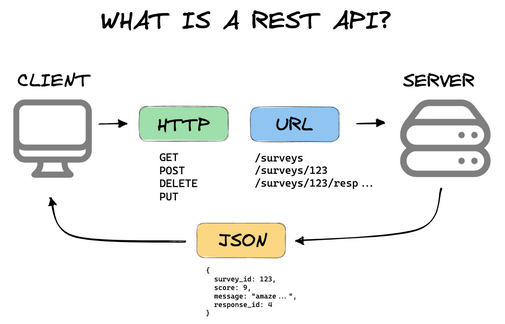

<!-- TO-DO hay que revisar la base de datos -->

<!DOCTYPE html>
<html lang="es">
<head>
    <meta charset="UTF-8">
    <meta name="viewport" content="width=device-width, initial-scale=1.0">
    <link rel="stylesheet" href="planteamiento_proyecto.css">
</head>
</html>

<h2 align="left" style="font-style: normal; font-size: 15px; margin:0; border-bottom: none;"> Proyecto: TFG EyA-Uvigo-Jose-Torre</h2>

<h2 style="font-style: normal; font-size: 15px; margin:0; border-bottom: none;"> Alumno: Jose Tomas Torre Pedroarena </h2>

<h1 align="center" style="margin: 20px 0 30px 0; font-size:30px; border-bottom: none; text-decoration: underline;">Aplicación de Gestión de Almacén: Presentación del Proyecto</h1>

Este software pretende ser una aplicación de gestión de un almacén que permita a los operarios realizar los diferentes procesos de almacenamiento y mantenimiento de productos, así como a los administradores y gestores de gestionar el almacén y sus productos.
Para desarrollar un proyecto de gestión de almacenes completo, es esencial incluir un conjunto de características y funcionalidades que cubran tanto las necesidades operativas de los empleados en el almacén (como el movimiento de los palets dentro del almacén, la gestión de los pedidos, etc.) como las de los administradores y gestores (como la gestión de inventario, pedidos, reportes, etc.).

    <!--  -->
    
    
    
 <a  style="color: #af7ac5" >Figura 1:</a> Ejemplos de almacenes reales a gestionar

## Funcionamiento de los almacenes a gestionar

 

  

  
 <a  style="color: #af7ac5" >Figura 2:</a> Funcionamiento de un almacén de consolidación.

 

 

  

  
 <a  style="color: #af7ac5" >Figura 3:</a> Funcionamiento de un almacén de división de envíos.
  

 

NOTA: Para informacion sobre estos modos de funcionamiento ver la pagina 13 de `/Documentacion_complementaria/'El almacén en la cadena logística.pdf'`

### Funciones del almacen

1. Recepción de productos
2. Almacenaje y manutención
3. Preparación de pedidos
4. Organización y control de las existencias

## Funcionalidades del software

Para cubrir las funciones del almacen el software debe tener en cuenta las siguiente funcionalidades

**1. Gestión de Inventario:**

- Registro de Productos:
  - Agregar, editar y eliminar productos.
  - Información detallada de los productos: código de barras, nombre, descripción, categoría, proveedor,- precio, unidades en stock, etc.
- Control de Stock:
  - Niveles mínimos y máximos de stock.
  - Alertas de productos en niveles bajos o agotados.
  - Ubicación de Productos en el Almacén:
    - Asignar productos a estanterías o zonas específicas del almacén (integrando con la vista 3D que ya tienes).
- Historial de Movimientos:
  - Registro de entradas y salidas de productos, devoluciones y transferencias entre almacenes.

**2. Gestión de Pedidos:**

- Recepción de Pedidos (Entradas):
  - Crear y gestionar órdenes de compra a proveedores.
  - Registro de las entradas de productos al almacén.
- Gestión de Pedidos de Clientes (Salidas):
  - Procesar pedidos de clientes, asignar productos y gestionar el picking (preparación de los pedidos).
  - Registro del estado de los pedidos (pendiente, preparado, enviado, entregado).

**3. Control de Picking y Packing:**

- Picking Automático:
  - Asignar y optimizar la ruta para que los operarios recojan los productos en el almacén, mostrando la ubicación de los mismos.
- Packing:
  - Gestión de embalaje y preparación de los pedidos antes del envío.

**4. Gestión de Usuarios y Roles:**

- Control de Acceso:
  - Permitir la creación de diferentes roles de usuario (administradores, operarios, supervisores) con- permisos específicos.
  - Historial de Acciones:
    - Registrar las acciones realizadas por cada usuario (como cambios en el inventario, pedidos gestionados,- etc.) para tener un control y trazabilidad.

**5. Interfaz Móvil para Operarios:**

- Acceso desde Dispositivos Móviles:
  - Crear una aplicación móvil o web responsive para que los operarios puedan:
  - Consultar inventario en tiempo real.
  - Escanear productos usando la cámara del móvil (código de barras o QR).
  - Registrar entradas y salidas de productos desde el almacén.
- Notificaciones en Tiempo Real:
  - Alertas sobre tareas pendientes (recoger productos, gestionar devoluciones, realizar auditorías, etc.).

**6. Integración con Base de Datos:**

- Conexión a una Base de Datos Centralizada:
  - Usa una base de datos (SQL o NoSQL, según lo que prefieras) para almacenar toda la información del almacén (productos, ubicaciones, usuarios, pedidos, etc.).
  - Sincronización en tiempo real entre la aplicación de escritorio y la aplicación móvil/tablet.
- Backups y Recuperación de Datos:
  - Implementar un sistema de copias de seguridad y restauración para prevenir pérdida de información crítica.

**7. Informes y Análisis:**

- Generación de Reportes:
  - Informes de ventas, productos más vendidos, productos con mayor rotación, inventario actual, etc.
- Análisis de Rendimiento:
  - Monitorear el rendimiento del almacén, tiempos de procesamiento de pedidos, eficiencia de los operarios y otros KPIs.
- Visualización Gráfica:
  - Incluir gráficos de barras, pastel, líneas para visualizar tendencias de inventario y rendimiento.

**8. Funcionalidades Adicionales:**

- Devoluciones y Reclamaciones:
  - Gestionar devoluciones de productos defectuosos o incorrectos y mantener un registro de estos casos.
- Gestión de Proveedores y Clientes:
  - Base de datos de proveedores y clientes con capacidad de gestionar pedidos de compra y ventas.
- Control de Mermas: Registrar productos dañados o vencidos y su correcta eliminación del inventario.

~~**9. Seguridad y Auditorías:**~~
~~- Cifrado de Datos:~~
~~- Asegurar que la información confidencial (como contraseñas y datos de clientes) esté protegida mediante cifrado.~~
~~- Auditoría de Seguridad:~~
~~- Implementar un sistema que permita revisar qué cambios han sido realizados por cada usuario y cuándo.~~

**10. Escalabilidad y Extensibilidad:**

- Conexiones a otros Sistemas:
  Si planeas a largo plazo, sería útil dejar abierto un espacio para integrar tu sistema con otros sistemas de ERP o de gestión de logística.
  API:
- Considera el desarrollo de una API para permitir la integración de la aplicación con otros sistemas externos.

  
 <a style="color: #af7ac5" >Tabla 1. </a> funcionalidades del software

  <table id="tabla_funciones_a_realizar" style="margin-top: 10px">
      <thead>
          <tr>
              <th>Funcionalidades del software</th>
          </tr>
      </thead>
      <tbody>
          <tr><td>Gestión de proveedores</td></tr>
          <tr><td>Gestión de clientes</td></tr>
          <tr><td>Gestión de pedidos</td></tr>
          <tr><td>Control de existencias</td></tr>
          <tr><td>Documentos API</td></tr>
          <tr><td>Soporte de aplicaciones Android</td></tr>
          <tr><td><del>Múltiples almacenes</del></td></tr>
          <tr><td><del>Exposición de existencias de seguridad</del></td></tr>
          <tr><td><del>Escáner PDA</del></td></tr>
          <tr><td><del>Soporte de aplicaciones IOS</del></td></tr>
      </tbody>
  </table>

<!--
|           IMPLEMENTACIONES             |
| -------------------------------------- |
| Múltiples almacenes                    |
| Gestión de proveedores                 |
| Gestión de clientes                    |
| Escáner PDA                            |
| Conteo de ciclos                       |
| Gestión de pedidos                     |
| Control de existencias                 |
| Exposición de existencias de seguridad |
| Documentos API                         |
| Soporte de aplicaciones IOS            |
| Soporte de aplicaciones Android        |
| Soporte de aplicaciones electrónicas   |
-->

## Esquema de la aplicación de escritorio (Desktop app)

La aplicación de escritorio es la versión más importante del sistema, se encarga de gestionar el almacén y el equipo de operarios. Para su uso será necesario que el empleado se identifique con su usuario y contraseña para asi gestionar los permisos que las diferentes personas tienen, y que esté conectado a la base de datos. Los diferentes usuarios están descritos en la sección "<a href="#seccion2" style="font-style:italic; color:#3498db">Usuarios, Roles y Permisos</a>"

al aplicación de escritorio debe tener los siguientes componentes:

1. Pantalla de Inicio de Sesión

   - Características:
     - Campos para ingresar el correo y la contraseña.
     - Opción para recordar la sesión.
     - Botón de "Iniciar Sesión".
     - Enlace para recuperar la contraseña.

2. Panel de Control

   - Características:
     - Visión general del estado del almacén (productos disponibles, movimientos recientes, etc.).
     - Acceso rápido a las funcionalidades principales (gestionar productos, palets, movimientos, pedidos, etc.).

3. Gestión de Usuarios

   - Ventanas:
     - Lista de Usuarios: Mostrar todos los usuarios con opciones para editar o eliminar.
     - Formulario de Usuario: Para agregar o editar usuarios (nombre, email, rol, estado).

4. Gestión de Roles

   - Ventanas:
     - Lista de Roles: Mostrar todos los roles disponibles con opciones para agregar, editar o eliminar.
     - Formulario de Rol: Para agregar o editar roles (nombre y descripción).

5. Gestión de Productos

   - Ventanas:
     - Lista de Productos: Mostrar todos los productos con opciones para agregar, editar o eliminar.
     - Formulario de Producto: Para agregar o editar productos (nombre, descripción, precio).

6. Gestión de Palets

   - Ventanas:
     - Lista de Palets: Mostrar todos los palets con información sobre ubicación y cantidad.
     - Formulario de Palet: Para agregar o editar palets (tipo de producto, cantidad, ubicación).

7. Registro de Movimientos

   - Ventanas:
     - Lista de Movimientos: Mostrar todos los movimientos de palets (entrada/salida).
     - Formulario de Movimiento: Para registrar un nuevo movimiento (tipo, cantidad, observaciones).

8. Gestión de Pedidos

   - Ventanas:
     - Lista de Pedidos: Mostrar todos los pedidos realizados con su estado.
     - Formulario de Pedido: Para agregar o editar pedidos (productos, cantidades).

9. Informes y Estadísticas

   - Ventanas:
     - Gráficos y tablas que muestren el rendimiento del almacén (productos más vendidos, estado de inventarios, etc.).

10. Configuración

    - Ventanas:
      - Opción para gestionar la configuración de la aplicación (por ejemplo, parámetros del sistema, opciones de notificación).

    
    
 <a style="color: #af7ac5" >Figura 4:</a> Jerarquía de las ventanas principales (<a href="https://app.diagrams.net/" style="color: #3498db" >https://app.diagrams.net/</a>)

Las ventanas principales que componen la aplicación se muestran son:

- Inicio de sesión
- Ventana principal: elegimos la accion principàl que queremos realizar (gestión del almacen, pedidos, etc.)
- Infomacion del usuario: muestra información sobre el usuario actual asi como los permisos que tiene
- Administración del almacen: muestra los palets que hay en él con los diferentes productos que hay en cada palet
- Pedidos:
  - Pedidos pendientes: muestra todos los pedidos que se deben realizar pero que ningun operario está ejecutando
  - Pedidos en curso: muestra todos los pedidos que están ejecutando los operarios

    
    
 <a style="color: #af7ac5" >Figura 5:</a> Bocetos de las ventanas principales (<a href="https://app.diagrams.net/" style="color: #3498db" >https://app.diagrams.net/</a>)

La visualización de los almacenes en la ventana de _GESTIÓN ALMACEN_ se puede hacer en 3D o 2D, dependiendo de las necesidades del usuario. La opción 3D permite visualizar los productos en un entorno más realista, mientras que la opción 2D se enfoca en una visualización más simple y rápida.

    
    
 <a style="color: #af7ac5" >Figura 6:</a> Visualización de los almacenes en 3D y 2D 

## Aplicación Android

1. Pantalla de Inicio de Sesión

   - Características:
     - Campos para el correo y la contraseña.
     - Opción de "Recordar Sesión".
     - Botón de "Iniciar Sesión".
     - Enlace para recuperación de contraseña.

2. Pantalla Principal

   - Características:
     - Visión general del estado del almacén.
     - Acceso a las funcionalidades principales (registrar movimientos, pedidos, etc.).

3. Registro de Movimientos

   - Ventanas:
     - Formulario de Movimiento: Para registrar la entrada o salida de palets (tipo, cantidad, observaciones).
     - Opción para escanear códigos de barras de los productos/palets.

4. Gestión de Pedidos

   - Ventanas:
     - Lista de Pedidos: Mostrar los pedidos activos y su estado.
     - Formulario de Pedido: Para crear un nuevo pedido (seleccionar productos y cantidades).

5. Visualización de Productos

   - Ventanas:
     - Lista de Productos: Mostrar todos los productos disponibles en el almacén.
     - Detalles de cada producto (descripción, precio, ubicación).

6. Notificaciones

   - Características:
     - Alertas para movimientos de inventario o cambios en el estado de los pedidos.

## Base de datos

Código de la base de datos en la ruta: `/Presentacion-Proyecto/almacenesBDD.sql`

Entidades clave a considerar:

- **Usuarios** (Administradores, Operarios, Clientes, etc.)
- **Almacenes** (Si gestionas múltiples almacenes)
- **Productos** (Inventario de productos)
- **Proveedores**
- **Clientes**
- **Pedidos** (Pedidos realizados, ya sea de clientes o proveedores)
- **Movimientos de stock** (Entrada y salida de productos)

    
    
 <a style="color: #af7ac5" >Figura 7:</a>  Diagrama de la base de datos (MySQL Workbench)

<!-- **leyenda de los símbolos de las tablas:** -->

<!--  ->

**1. Tabla `Roles`**

Esta tabla define los diferentes roles que pueden tener los usuarios en el sistema.

- `id_rol`: Identificador único para cada rol.
- `nombre_rol`: Nombre del rol, como sysAdmin, Gestor, Operario, etc.
- `descripción`: Descripción detallada del rol y sus permisos dentro del sistema.

  
 <a style="color: #af7ac5" >Tabla 2. </a> Tabla roles BDD

  <table class="bdd" style="margin: 10px 0 0 0;">
    <thead>
        <tr>
            <th>Campo</th>
            <th>Tipo de dato</th>
            <th>Descripción</th>
        </tr>
    </thead>
    <tbody>
        <tr><td>id_rol</td><td>INT (PK, AUTO_INCREMENT)</td><td>Identificador único del rol.</td></tr>
        <tr><td>nombre_rol</td><td>VARCHAR(50)</td><td>Nombre del rol en el sistema.</td></tr>
        <tr><td>descripción</td><td>TEXT</td><td>Descripción del rol y sus permisos.</td></tr>
    </tbody>
</table>

**2. Tabla `Usuarios`**

Esta tabla almacena la información de todos los usuarios que interactúan con la aplicación.

- `id_usuario`: Identificador único para cada usuario.
- `nombre`: Nombre completo del usuario.
- `email`: Correo electrónico del usuario, utilizado para el inicio de sesión.
- `contraseña`: Contraseña cifrada del usuario.
- `id_rol`: Hace referencia al rol del usuario, como sysAdmin, Gestor, Operario, etc.
- `fecha_registro`: Fecha en la que el usuario se registró en el sistema.

  
 <a style="color: #af7ac5" >Tabla 3. </a> Tabla usuarios BDD

  <table class="bdd" style="margin: 10px 0 0 0;">
    <thead>
        <tr>
            <th>Campo</th>
            <th>Tipo de dato</th>
            <th>Descripción</th>
        </tr>
    </thead>
    <tbody>
        <tr><td>id_usuario</td><td>INT (PK, AUTO_INCREMENT)</td><td>Identificador único del usuario.</td></tr>
        <tr><td>nombre</td><td>VARCHAR(100)</td><td>Nombre completo del usuario.</td></tr>
        <tr><td>email</td><td>VARCHAR(100)</td><td>Correo electrónico del usuario (único).</td></tr>
        <tr><td>contraseña</td><td>VARCHAR(255)</td><td>Contraseña cifrada del usuario.</td></tr>
        <tr><td>id_rol</td><td>INT (FK)</td><td>Referencia al rol del usuario en el sistema.</td></tr>
        <tr><td>fecha_registro</td><td>TIMESTAMP</td><td>Fecha y hora del registro del usuario.</td></tr>
    </tbody>
</table>

**3. Tabla `Productos`**

Esta tabla almacena información sobre los productos gestionados en el almacén.

- `id_producto`: Identificador único para cada producto.
- `nombre_producto`: Nombre del producto.
- `descripción`: Descripción detallada del producto.
- `precio`: Precio unitario del producto.
- `fecha_registro`: Fecha de registro del producto en el sistema.

  
 <a style="color: #af7ac5" >Tabla 4. </a> Tabla productos BDD

  <table class="bdd" style="margin: 10px 0 0 0;">
    <thead>
        <tr>
            <th>Campo</th>
            <th>Tipo de dato</th>
            <th>Descripción</th>
        </tr>
    </thead>
    <tbody>
        <tr><td>id_producto</td><td>INT (PK, AUTO_INCREMENT)</td><td>Identificador único del producto.</td></tr>
        <tr><td>nombre_producto</td><td>VARCHAR(100)</td><td>Nombre del producto.</td></tr>
        <tr><td>descripción</td><td>TEXT</td><td>Descripción del producto.</td></tr>
        <tr><td>precio</td><td>DECIMAL(10, 2)</td><td>Precio unitario del producto.</td></tr>
        <tr><td>fecha_registro</td><td>TIMESTAMP</td><td>Fecha de registro del producto.</td></tr>
    </tbody>
</table>

**4. Tabla `Palets`**

Esta tabla almacena información sobre cada palet en el almacén. Cada palet contiene un único tipo de producto y tiene una ubicación específica en el almacén.

- `id_palet`: Identificador único para cada palet.
- `id_producto`: Hace referencia al producto que contiene el palet.
- `cantidad`: Cantidad de productos en el palet.
- `ubicacion`: Ubicación del palet dentro del almacén.
- `fecha_registro`: Fecha de registro del palet en el sistema.

  
 <a style="color: #af7ac5" >Tabla 5. </a> Tabla palets BDD

  <table class="bdd" style="margin: 10px 0 0 0;">
    <thead>
        <tr>
            <th>Campo</th>
            <th>Tipo de dato</th>
            <th>Descripción</th>
        </tr>
    </thead>
    <tbody>
        <tr><td>id_palet</td><td>INT (PK, AUTO_INCREMENT)</td><td>Identificador único del palet.</td></tr>
        <tr><td>id_producto</td><td>INT (FK)</td><td>Referencia al producto contenido en el palet.</td></tr>
        <tr><td>cantidad</td><td>INT</td><td>Cantidad de productos en el palet.</td></tr>
        <tr><td>ubicacion</td><td>VARCHAR(100)</td><td>Ubicación del palet en el almacén.</td></tr>
        <tr><td>fecha_registro</td><td>TIMESTAMP</td><td>Fecha de registro del palet en el sistema.</td></tr>
    </tbody>
</table>

**5. Tabla `Movimientos`**

Esta tabla registra la entrada y salida de palets en el almacén. Cada movimiento está asociado a un usuario que realiza la operación y al palet afectado.

- `id_movimiento`: Identificador único del movimiento.
- `id_usuario`: Hace referencia al usuario que realizó el movimiento.
- `id_palet`: Hace referencia al palet afectado por el movimiento.
- `tipo_movimiento`: Tipo de movimiento, puede ser 'Entrada' o 'Salida'.
- `cantidad`: Cantidad de productos movidos.
- `fecha_movimiento`: Fecha en la que se registró el movimiento.
- `observaciones`: Observaciones adicionales sobre el movimiento.

  
 <a style="color: #af7ac5" >Tabla 6. </a> Tabla movimientos BDD

  <table class="bdd" style="margin: 10px 0 0 0;">
    <thead>
        <tr>
            <th>Campo</th>
            <th>Tipo de dato</th>
            <th>Descripción</th>
        </tr>
    </thead>
    <tbody>
        <tr><td>id_movimiento</td><td>INT (PK, AUTO_INCREMENT)</td><td>Identificador único del movimiento.</td></tr>
        <tr><td>id_usuario</td><td>INT (FK)</td><td>Referencia al usuario que realizó el movimiento.</td></tr>
        <tr><td>id_palet</td><td>INT (FK)</td><td>Referencia al palet afectado.</td></tr>
        <tr><td>tipo_movimiento</td><td>ENUM('Entrada', 'Salida')</td><td>Tipo de movimiento del palet.</td></tr>
        <tr><td>cantidad</td><td>INT</td><td>Cantidad de productos movidos.</td></tr>
        <tr><td>fecha_movimiento</td><td>TIMESTAMP</td><td>Fecha de registro del movimiento.</td></tr>
        <tr><td>observaciones</td><td>TEXT</td><td>Observaciones sobre el movimiento.</td></tr>
    </tbody>
</table>

**6. Tabla `Pedidos`**

Esta tabla almacena los pedidos realizados en el almacén, especificando el usuario que los realiza y su estado.

- `id_pedido`: Identificador único del pedido.
- `id_usuario`: Hace referencia al usuario que realizó el pedido.
- `fecha_pedido`: Fecha en la que se realizó el pedido.
- `estado`: Estado del pedido, puede ser 'Pendiente', 'Completado' o 'Cancelado'.

  
 <a style="color: #af7ac5" >Tabla 7. </a> Tabla pedidos BDD

  <table class="bdd" style="margin: 10px 0 0 0;">
    <thead>
        <tr>
            <th>Campo</th>
            <th>Tipo de dato</th>
            <th>Descripción</th>
        </tr>
    </thead>
    <tbody>
        <tr><td>id_pedido</td><td>INT (PK, AUTO_INCREMENT)</td><td>Identificador único del pedido.</td></tr>
        <tr><td>id_usuario</td><td>INT (FK)</td><td>Referencia al usuario que realizó el pedido.</td></tr>
        <tr><td>fecha_pedido</td><td>TIMESTAMP</td><td>Fecha de realización del pedido.</td></tr>
        <tr><td>estado</td><td>ENUM('Pendiente', 'Completado', 'Cancelado')</td><td>Estado actual del pedido.</td></tr>
    </tbody>
</table>

**7. Tabla `DetallesPedido`**

Esta tabla almacena los detalles de cada pedido realizado, especificando qué palets de productos fueron solicitados.

- `id_detalle`: Identificador único del detalle de pedido.
- `id_pedido`: Hace referencia al pedido al que pertenece este detalle.
- `id_palet`: Hace referencia al palet de productos solicitado en el pedido.
- `cantidad`: Cantidad de productos solicitados.

  
 <a style="color: #af7ac5" >Tabla 8. </a> Tabla detallesPedido BDD

  <table class="bdd" style="margin: 10px 0 0 0;">
    <thead>
        <tr>
            <th>Campo</th>
            <th>Tipo de dato</th>
            <th>Descripción</th>
        </tr>
    </thead>
    <tbody>
        <tr><td>id_detalle</td><td>INT (PK, AUTO_INCREMENT)</td><td>Identificador único del detalle de pedido.</td></tr>
        <tr><td>id_pedido</td><td>INT (FK)</td><td>Referencia al pedido correspondiente.</td></tr>
        <tr><td>id_palet</td><td>INT (FK)</td><td>Referencia al palet solicitado en el pedido.</td></tr>
        <tr><td>cantidad</td><td>INT</td><td>Cantidad de productos solicitados.</td></tr>
    </tbody>
</table>

### Relaciones entre las tablas

- Relación entre `Roles` y `Usuarios`:

  - Campo relacionado: id_rol
  - Tipo de relación: Uno a muchos
  - Descripción: Un rol puede estar asignado a varios usuarios. En la tabla Usuarios, el campo id_rol actúa como clave foránea que referencia al campo id_rol en la tabla Roles, permitiendo saber qué rol tiene cada usuario.

- Relación entre `Usuarios` y `Movimientos`:

  - Campo relacionado: id_usuario
  - Tipo de relación: Uno a muchos
  - Descripción: Un usuario puede realizar múltiples movimientos. En la tabla Movimientos, el campo id_usuario es una clave foránea que referencia al campo id_usuario de la tabla Usuarios. Esto permite rastrear qué usuario realizó cada movimiento de entrada o salida de palets.

- Relación entre `Productos` y `Palets`:

  - Campo relacionado: id_producto
  - Tipo de relación: Uno a muchos
  - Descripción: Un producto puede estar presente en múltiples palets. En la tabla Palets, el campo id_producto es una clave foránea que referencia a id_producto en la tabla Productos. De esta manera, podemos identificar qué producto contiene cada palet.

- Relación entre `Palets` y `Movimientos`:

  - Campo relacionado: id_palet
  - Tipo de relación: Uno a muchos
  - Descripción: Un palet puede estar involucrado en múltiples movimientos. En la tabla Movimientos, el campo id_palet es una clave foránea que referencia a id_palet en la tabla Palets. Esto permite registrar qué palet está siendo movido en cada operación de entrada o salida.

- Relación entre `Usuarios` y `Pedidos`:

  - Campo relacionado: id_usuario
  - Tipo de relación: Uno a muchos
  - Descripción: Un usuario puede crear múltiples pedidos. En la tabla Pedidos, el campo id_usuario es una clave foránea que hace referencia al campo id_usuario en la tabla Usuarios, indicando qué usuario realizó cada pedido.

- Relación entre `Pedidos` y `DetallesPedido`:

  - Campo relacionado: id_pedido
  - Tipo de relación: Uno a muchos
  - Descripción: Un pedido puede tener múltiples detalles. En la tabla DetallesPedido, el campo id_pedido es una clave foránea que referencia a id_pedido en la tabla Pedidos. Esto permite registrar los productos que forman parte de cada pedido.

- Relación entre `Palets` y `DetallesPedido`:
  - Campo relacionado: id_palet
  - Tipo de relación: Uno a muchos
  - Descripción: Un palet puede ser solicitado en múltiples detalles de pedidos. En la tabla DetallesPedido, el campo id_palet es una clave foránea que referencia a id_palet en la tabla Palets, indicando qué palets se están solicitando en cada pedido.

### Resumen de las claves foráneas

Aquí está un resumen de las relaciones y claves foráneas en la base de datos:

- **Usuarios**:

  - `id_rol` → Referencia a `Roles(id_rol)`

- **Palets**:

  - `id_producto` → Referencia a `Productos(id_producto)`

- **Movimientos**:

  - `id_usuario` → Referencia a `Usuarios(id_usuario)`
  - `id_palet` → Referencia a `Palets(id_palet)`

- **Pedidos**:

  - `id_usuario` → Referencia a `Usuarios(id_usuario)`

- **DetallesPedido**:
  - `id_pedido` → Referencia a `Pedidos(id_pedido)`
  - `id_palet` → Referencia a `Palets(id_palet)`

Explicación de cada relación:

- En Usuarios, el campo id_rol hace referencia a la tabla Roles, lo que significa que cada usuario tiene un rol asociado.
- En Palets, el campo id_producto hace referencia a la tabla Productos, indicando el tipo de producto que contiene el palet.
- En Movimientos, el campo id_usuario hace referencia a Usuarios, indicando qué usuario realizó el movimiento, mientras que id_palet hace referencia a Palets, identificando el palet afectado.
- En Pedidos, el campo id_usuario se relaciona con Usuarios, permitiendo saber qué usuario realizó el pedido.
- Finalmente, en DetallesPedido, id_pedido se relaciona con Pedidos, especificando a qué pedido pertenece el detalle, y id_palet se refiere a Palets, indicando el palet específico que se solicita en el pedido.

## Tecnologías a Considerar:

_**Base de Datos:**_ PostgreSQL, MySQL, o alguna solución NoSQL como MongoDB si se prevé un alto volumen de datos no estructurados.

_**Aplicación Móvil:**_ Puede desarrollarse en Flutter, React Native o incluso en Android/iOS nativo dependiendo de tus necesidades.

_**Conexión entre aplicaciones:**_ Para sincronizar datos entre la app móvil y de escritorio, puedes usar una API REST o WebSockets para comunicación en tiempo real.

_**Seguridad:**_ Usa JWT para la autenticación de usuarios y controla los permisos con base en los roles.

## Lenguajes de programación

Para desarrollar la aplicación de gestión de almacenes con las características anteriores, podemos usar las siguientes tecnologías. Cada una de ellas tiene sus propias ventajas y desventajas, por lo que es importante evaluar cuál es la mejor opción para tu proyecto.

**1. Aplicación de Escritorio (JavaFX)**

Lenguaje: Java
JavaFX es una excelente opción para crear interfaces gráficas (GUI) en aplicaciones de escritorio. Ya tienes la representación 3D implementada en JavaFX, por lo que seguir con Java es una buena elección.
Java es robusto, tiene gran soporte para aplicaciones de escritorio, y su integración con bases de datos mediante JDBC (Java Database Connectivity) es muy sencilla.

**2. Base de Datos**

Lenguaje: SQL (o NoSQL si decides optar por un enfoque diferente)
Si decides usar una base de datos relacional como MySQL, PostgreSQL, o SQLite, necesitarás escribir consultas SQL para manipular datos (inserciones, consultas, actualizaciones y borrados).
Si prefieres un enfoque más flexible o con alto volumen de datos, puedes optar por una base de datos NoSQL como MongoDB, aunque en un sistema de gestión de almacenes, un enfoque relacional es generalmente más apropiado.

**3. Aplicación Móvil (para Operarios)**

- Opción 1: Aplicación nativa para Android

  Lenguaje: Kotlin o Java (Android).\*\* _Kotlin_ es el lenguaje oficial para el desarrollo de aplicaciones Android, pero también puedes usar Java si prefieres mantener la coherencia con la aplicación de escritorio. Esto permitirá desarrollar una aplicación nativa específica para Android, que puede interactuar con la base de datos centralizada a través de una API REST.

- ~~**Opción 2:** Aplicación Multiplataforma~~
  ~~Flutter (que usa Dart) es una opción multiplataforma que te permite crear aplicaciones tanto para Android como iOS desde un solo código base.~~
  ~~React Native (con JavaScript o TypeScript) también permite el desarrollo multiplataforma, especialmente si estás más cómodo con el ecosistema JavaScript.~~
  ~~Ambas opciones son excelentes si deseas tener una única base de código para las aplicaciones móviles de operarios en Android y iOS.~~

**4. Back-End** (API REST para comunicación entre escritorio y móvil)

    
    
 <a style="color: #af7ac5" >Figura 8:</a> Descripción api rest

Tu aplicación de escritorio y móvil necesitarán conectarse a una base de datos central. Para ello, puedes construir una API REST que exponga los datos del almacén a ambas aplicaciones.

Lenguajes recomendados para crear la API REST:

- _**Java**_ (Spring Boot):

  Si ya estás usando Java para tu aplicación de escritorio, puedes optar por Spring Boot para crear el servidor backend. Es un framework popular para crear aplicaciones web y APIs REST, y te permitirá mantener un entorno coherente usando Java tanto en el cliente como en el servidor.

- _**Node.js**_ (JavaScript o TypeScript):

  Si prefieres un enfoque más rápido para crear una API, Node.js con Express es una opción popular para construir servidores. Puedes escribir el backend en JavaScript o TypeScript y es muy eficiente para gestionar aplicaciones en tiempo real, como las que requieren notificaciones o sincronización rápida.

- _**Python**_ (Django/Flask):

  Si prefieres usar Python, Django (que incluye Django REST Framework) o Flask son opciones excelentes para desarrollar APIs REST. Python es limpio, tiene una curva de aprendizaje más sencilla, y es muy utilizado en proyectos donde se requiere rapidez de desarrollo.

**5. Conexión a Base de Datos**

Lenguaje: SQL (en el caso de usar bases de datos relacionales como MySQL o PostgreSQL).
Si usas Java en el backend, puedes utilizar JDBC (Java Database Connectivity) para interactuar con la base de datos, o frameworks ORM como Hibernate para simplificar la interacción con la base de datos.

~~**6. Frontend de la Aplicación Móvil** (Si decides usar una app web)~~

~~Si decides crear una aplicación web accesible desde dispositivos móviles (en lugar de una app nativa o además de ella), puedes usar tecnologías web modernas:~~

~~HTML, CSS, JavaScript (o TypeScript) para el frontend. Frameworks populares como React.js, Vue.js, o Angular pueden ayudarte a crear una interfaz de usuario responsiva que funcione en dispositivos móviles y tablets.~~

### Resumen de Lenguajes y Tecnologías por Componente

  
 <a style="color: #af7ac5" >Tabla 9. </a> lenguajes de programación y tecnologias 

  <table style="margin: 10px 0 0 0;">
  <thead>
      <tr>
          <th>Componente</th>
          <th>Lenguaje Recomendado</th>
          <th>Alternativas</th>
      </tr>
      </thead>
      <tbody>
      <tr>
          <td>Aplicación de Escritorio</td>
          <td>Java (JavaFX)</td>
          <td>---</td>
      </tr>
      <tr>
          <td>Base de Datos</td>
          <td>SQL</td>
          <td>NoSQL (MongoDB)</td>
      </tr>
      <tr>
          <td>API REST (Backend)</td>
          <td>Java (Spring Boot)</td>
          <td>Node.js (JavaScript/TypeScript), Python (Django/Flask), Go</td>
      </tr>
      <tr>
          <td>Aplicación Móvil</td>
          <td>Kotlin/Java (Android Nativo)</td>
          <td>Flutter (Dart), React Native (JavaScript/TypeScript)</td>
      </tr>
      <tr>
          <td>Interfaz Web (si decides usar una)</td>
          <td>HTML, CSS, JavaScript (React.js, Vue.js, Angular)</td>
          <td>---</td>
      </tr>
      </tbody>
  </table>

<!--
| Componente                         | Lenguaje Recomendado                              | Alternativas                                               |
| ---------------------------------- | ------------------------------------------------- | ---------------------------------------------------------- |
| Aplicación de Escritorio           | Java (JavaFX)                                     | ---                                                        |
| Base de Datos                      | SQL1                                              | NoSQL (MongoDB)                                            |
| API REST (Backend)                 | Java (Spring Boot)                                | Node.js (JavaScript/TypeScript), Python (Django/Flask), Go |
| Aplicación Móvil                   | Kotlin/Java (Android Nativo)                      | Flutter (Dart), React Native (JavaScript/TypeScript)       |
| Interfaz Web (si decides usar una) | HTML, CSS, JavaScript (React.js, Vue.js, Angular) | ---                                                        |
 -->

### Recomendación General

Como ya tengo experiencia con Java y JavaFX, se podrá mantener el ecosistema Java para la aplicación de escritorio y el backend, usando Spring Boot para la API REST. Luego, podemos optar por Kotlin o Java para una aplicación nativa en Android, o si queremos mayor flexibilidad, usar Flutter para crear una app multiplataforma.

Para la base de datos, es recoemendable usar MySQL o PostgreSQL, que son muy robustas para gestionar inventarios y transacciones en tiempo real.

<h3 id="seccion2" style="margin-bottom: 30px"> </h3>

## Usuarios, Roles y Permisos

Para que una persona pueda acceder a la aplicación, se requiere que tenga un usuario y contraseña. Estos usuarios y contraseñas se encuentran en la tabla "Usuarios" de la base de datos. Para cada usuario, se puede definir los diferentes roles que tiene, y los permisos que tiene para cada uno de ellos.

cuando el usuario desea hacer una determinada acción en la aplicación, se debe verificar que el usuario tenga los permisos necesarios para realizar dicha acción. Esto se logra verificando que el usuario tenga el rol correspondiente y que el rol tenga los permisos necesarios para realizar dicha acción. Si el usuario no tiene los permisos necesarios, entonces se le debe notificar al usuario que no tiene los permisos necesarios para realizar dicha acción.

    
    
 <a style="color: #af7ac5" >Figura 9:</a> Gestión de roles de usuario (<a href="https://app.diagrams.net/" style="color: #3498db" >https://app.diagrams.net/</a>)

**1. Administrador del Sistema (SysAdmin)**

- Responsabilidades:
  - Administrar y configurar todo el sistema.
  - Gestionar la creación, edición y eliminación de otros usuarios.
  - Controlar la base de datos (backups, recuperación, mantenimiento).
  - Acceso total a todas las funciones de la aplicación.
- Permisos:
  - Crear, modificar y eliminar roles de usuario.
  - Acceso completo a todas las funcionalidades (gestión de productos, pedidos, reportes, etc.).
  - Modificar configuraciones del sistema.
  - Revisar los registros de auditoría y el historial de actividades.
  - Ver todos los informes de rendimiento y análisis del almacén.

**2. Gestor de Almacén**

- Responsabilidades:
  - Gestionar el inventario y el flujo de productos dentro del almacén.
  - Coordinar y supervisar al equipo de operarios.
  - Generar y gestionar informes de rendimiento e inventario.
- Permisos:
  - Ver, agregar, editar y eliminar productos.
  - Acceder a la ubicación de los productos en el almacén (y, si es necesario, modificarla).
  - Gestionar las órdenes de compra (entrada de productos) y pedidos de clientes (salida de productos).
  - Asignar tareas a los operarios (picking, packing).
  - Consultar informes de inventario, rendimiento de productos y productividad de los operarios.
  - Revisar el historial de movimientos de inventario.

**3. Supervisor de Almacén**

- Responsabilidades:
  - Supervisar las operaciones diarias del almacén.
  - Asegurarse de que los pedidos se procesen correctamente y a tiempo.
  - Gestionar el inventario, asegurándose de que esté actualizado.
  - Coordinar el trabajo de los operarios en la planta.
- Permisos:
  - Ver y actualizar el inventario.
  - Asignar tareas a los operarios (picking, packing).
  - Procesar pedidos y entradas de productos.
  - Controlar la recepción y despacho de mercancía.
  - Generar reportes básicos de inventario y productividad.
  - Revisar el historial de movimientos recientes.

**4. Operario de Almacén**

- Responsabilidades:
  - Ejecutar las tareas operativas en el almacén (picking, packing, almacenamiento).
  - Procesar pedidos de clientes y realizar la preparación de los mismos.
  - Registrar la entrada y salida de productos.
  - Escanear productos y actualizarlos en el sistema.
- Permisos:
  - Ver el inventario y la ubicación de los productos.
  - Marcar productos como recogidos para un pedido (picking).
  - Registrar entradas de productos (recepción).
  - Actualizar el estado de los pedidos (pendiente, preparado, enviado).
  - Escanear productos para su registro (usando un lector de códigos de barras o la cámara de un dispositivo móvil).
  - Acceder a su historial de tareas completadas.

**5. Operario de Mantenimiento**

- Responsabilidades:
  - Supervisar el estado físico del almacén y sus instalaciones.
  - Informar y gestionar incidencias relacionadas con el almacenamiento o el estado de los productos.
  - Realizar mantenimientos preventivos y correctivos en las instalaciones del almacén.
- Permisos:
  - Acceder a la información sobre la disposición y estado físico de los productos.
  - Registrar problemas o daños en productos o estanterías.
  - Acceder a las tareas relacionadas con la infraestructura del almacén, pero no con la gestión de inventario ni pedidos.

**6. Personal de Administración o Finanzas**

- Responsabilidades:
  - Gestionar el flujo financiero de compras y ventas.
  - Generar informes financieros sobre los productos del almacén (costos, ingresos, márgenes).
  - Coordinar con proveedores y clientes en aspectos financieros.
- Permisos:
  - Acceder a la información de pedidos y proveedores.
  - Ver el estado de los inventarios (sin modificar).
  - Generar informes financieros sobre el rendimiento de productos.
  - Consultar el historial de compras y ventas.
  - Ver los costos asociados a la gestión de inventario.

**7. Proveedor (Usuario Externo)**

- Responsabilidades:
  - Proveer mercancía al almacén y consultar sus órdenes de compra.
  - Actualizar el estado de envíos y confirmación de recepción de pedidos.
- Permisos:
  - Acceder a sus órdenes de compra y consultar su estado.
  - Confirmar el estado de entrega de mercancías.
  - Ver el inventario de los productos que suministran (si corresponde).

**8. Cliente (Usuario Externo)**

- Responsabilidades:
  - Realizar pedidos y consultas sobre el estado de sus compras.
  - Acceder a facturas y realizar devoluciones de productos.
- Permisos:
  - Consultar el catálogo de productos disponibles (si la plataforma lo permite).
  - Realizar pedidos.
  - Consultar el estado de sus pedidos y devoluciones.
  - Ver el historial de compras y facturas.

  
 <a style="color: #af7ac5" >Tabla 10. </a> roles de usuarios y permisos 

  <table style="margin: 10px 0 0 0;">

  <thead>
      <tr>
          <th>Funcionalidad</th>
          <th>SysAdmin</th>
          <th>Gestor Almacén</th>
          <th>Supervisor</th>
          <th>Operario</th>
          <th>Mantenimiento</th>
          <th>Administración</th>
          <th>Proveedor</th>
          <th>Cliente</th>
      </tr>
  </thead>
  <tbody>
      <tr>
          <td>Gestión de Usuarios</td>
          <td>✅</td>
          <td>❌</td>
          <td>❌</td>
          <td>❌</td>
          <td>❌</td>
          <td>❌</td>
          <td>❌</td>
          <td>❌</td>
      </tr>
      <tr>
          <td>Gestión de Productos (CRUD)</td>
          <td>✅</td>
          <td>✅</td>
          <td>✅</td>
          <td>❌</td>
          <td>❌</td>
          <td>❌</td>
          <td>❌</td>
          <td>❌</td>
      </tr>
      <tr>
          <td>Gestión de Inventario (stock, ubicación)</td>
          <td>✅</td>
          <td>✅</td>
          <td>✅</td>
          <td style="color: #3498db">Ver</td>
          <td>❌</td>
          <td style="color: #3498db">Ver</td>
          <td>❌</td>
          <td>❌</td>
      </tr>
      <tr>
          <td>Registro de Entradas/Salidas de Productos</td>
          <td>✅</td>
          <td>✅</td>
          <td>✅</td>
          <td>✅</td>
          <td>❌</td>
          <td>❌</td>
          <td>❌</td>
          <td>❌</td>
      </tr>
      <tr>
          <td>Gestión de Pedidos</td>
          <td>✅</td>
          <td>✅</td>
          <td>✅</td>
          <td>✅</td>
          <td>❌</td>
          <td style="color: #3498db">Ver</td>
          <td>❌</td>
          <td>✅</td>
      </tr>
      <tr>
          <td>Generación de Reportes (inventario, ventas)</td>
          <td>✅</td>
          <td>✅</td>
          <td>✅</td>
          <td>❌</td>
          <td>❌</td>
          <td>✅</td>
          <td>❌</td>
          <td>❌</td>
      </tr>
      <tr>
          <td>Asignación de Tareas (Picking/Packing)</td>
          <td>✅</td>
          <td>✅</td>
          <td>✅</td>
          <td>❌</td>
          <td>❌</td>
          <td>❌</td>
          <td>❌</td>
          <td>❌</td>
      </tr>
      <tr>
          <td>Acceso al Historial de Movimientos</td>
          <td>✅</td>
          <td>✅</td>
          <td>✅</td>
          <td style="color: #3498db">Ver</td>
          <td style="color: #3498db">Ver</td>
          <td style="color: #3498db">Ver</td>
          <td>❌</td>
          <td>❌</td>
      </tr>
      <tr>
          <td>Mantenimiento de Infraestructura</td>
          <td>✅</td>
          <td>❌</td>
          <td style="color: #3498db">Ver</td>
          <td>❌</td>
          <td>✅</td>
          <td>❌</td>
          <td>❌</td>
          <td>❌</td>
      </tr>
      <tr>
          <td>Gestión Financiera (compras/ventas)</td>
          <td>✅</td>
          <td>❌</td>
          <td>❌</td>
          <td>❌</td>
          <td>❌</td>
          <td>✅</td>
          <td>❌</td>
          <td style="color: #3498db">Ver</td>
      </tr>
      <tr>
          <td>Gestión de Incidencias</td>
          <td>✅</td>
          <td>❌</td>
          <td style="color: #3498db">Ver</td>
          <td style="color: #3498db">Ver</td>
          <td style="color: #3498db">Ver</td>
          <td>❌</td>
          <td>❌</td>
          <td>❌</td>
      </tr>
  </tbody>
</table>

