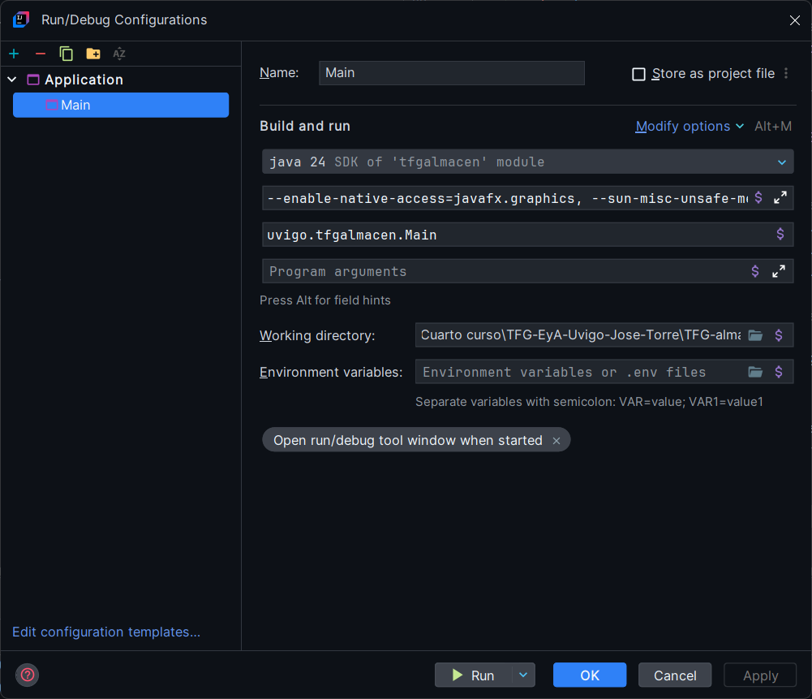

# TFG-EyA-Uvigo-Jose-Torre

TFG de ingeniería en electrónica industrial y automática de la Universidad de Vigo (Uvigo). Estuidiante Jose Tomas Torre Pedroarena

## Leer: `Presentacion-Proyecto/planteamiento_proyecto.md`

Este fichero es un boceto de cómo será el proyecto, sin embargo, con el desarrollo del proyecto habrán variaciones. Es simplemente una guía orientativa

⚠️ !! SE RECOMIENDA VER EL FICHERO EN UN VISUALIZADOR DE `MARKDOWN` QUE ACEPTE `HTML` ¡¡

## Código Fuente Java

El código fuente de la aplicacion de escritorio en **Java** se encuentra en `./TFG-almacen`. Este es el módulo que hay que importar en _**IntellIJ**_

⚠️ **De momento el proyecto solo funciona en local**

# Warnnigs al ejecutar el programa:
A la hora de ejecutar el proyecto, debido a la actuacion de java no puede salir un warnning ya que javafx aun no integró un cambio. Para solucionar este problema debemos introdu ir los siguientes parametros cuando ejecutemos la aplicación: 

1. Abre la configuración de ejecución
Ve al menú: `Run` > `Edit Configurations`

2. Selecciona tu configuración de ejecución
En el panel izquierdo, selecciona la configuración de ejecución de tu proyecto principal (generalmente el nombre de tu clase `Main` o `App`).

3. Agrega las opciones JVM
Haz click en `Modify options` -> `VM options`, añade lo siguiente:

`--enable-native-access=javafx.graphics, --sun-misc-unsafe-memory-access=allow`

