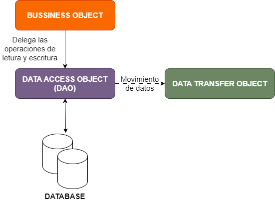

# Patrón de diseño DAO - _Data Access Object DAO) Pattern_

El DAO es un patrón de diseño estructural que se utiliza en el desarrollo de software para separar la lógica de acceso a los datos de la lógica de negocio de una aplicación. Su objetivo es proporcionar una interfaz abstracta para interactuar con diferentes fuentes de datos (bases de datos, archivos, servicios web, etc.), ocultando la implementación interna del acceso a los datos.

 <div style="display: flex; flex-direction: column; align-items: center; margin-bottom: 20px; margin-top: 20px; width: 100%;">

  

  <p style="margin: 0; font-style: italic; color: white; text-align: center;"> <a  style="color: #af7ac5" >Figura 1:</a> Patrón de diseño DAO. (<a href="https://www.youtube.com/watch?v=CEDKxPCgosY" style="color: #3498db" >El patrón DAO UPV</a>)
  </p>
</div>

### Propósito del DAO

1. Separación de preocupaciones: Permite que la lógica de negocio de la aplicación se mantenga independiente de los detalles de la persistencia de datos (es decir, cómo se almacenan y recuperan los datos).

2. Abstracción del acceso a datos: El DAO proporciona una capa de abstracción que facilita el acceso a datos, evitando que el código de negocio interactúe directamente con la base de datos o cualquier otra fuente de datos.

3. Facilita el mantenimiento y la escalabilidad: Si en el futuro decides cambiar el sistema de almacenamiento o la base de datos (por ejemplo, de MySQL a PostgreSQL), solo necesitarías modificar la implementación del DAO sin afectar la lógica de negocio.

### Funcionamiento del DAO

Interfaz DAO: Define los métodos de acceso a los datos (por ejemplo, `crear()`, `leer()`, `actualizar()`, `eliminar()`).
Implementación del DAO: Esta clase implementa los métodos definidos en la interfaz DAO y contiene la lógica de acceso a los datos (como consultas SQL o llamadas a una API).

#### Ejemplo

Supongamos que tienes una base de datos con una tabla `Usuario`. Podrías tener una interfaz `UsuarioDAO` con métodos como:

- `create()`: para insertar un nuevo usuario.
- `read()`: para obtener un usuario específico.
- `update()`: para actualizar los detalles de un usuario.
- `delete()`: para eliminar un usuario.

La implementación de esta interfaz (`UsuarioDAOImpl`) contendría el código específico para interactuar con la base de datos (por ejemplo, usando JDBC para MySQL).

Ventaja principal: Este patrón hace que tu código sea más modular, testable y fácil de mantener.

En resumen, DAO es una técnica que ayuda a manejar la persistencia de datos de manera eficiente, separando las preocupaciones entre la lógica de negocio y el acceso a los datos

# Documentación: Clase `DatabaseConnection`

Esta clase se encarga de gestionar la conexión con una base de datos MySQL para la aplicación **TFG Almacén**. Proporciona métodos para establecer y cerrar conexiones de manera eficiente.

---

## 1. Detalles de la Clase

### Paquete

```java
uvigo.tfgalmacen.database
```

### Importaciones

```java
import java.sql.Connection;
import java.sql.DriverManager;
import java.sql.SQLException;
import java.sql.Statement;
```

### Propósito

La clase `DatabaseConnection` maneja las operaciones básicas de conexión y cierre con la base de datos MySQL utilizando el controlador JDBC.

---

## 2. Constantes

### 2.1 URL de la base de datos

```java
private static final String URL = "jdbc:mysql://localhost:3306/tfg_almacenDB";
```

- **Descripción**: Dirección de la base de datos en MySQL.
- **Ejemplo**: Cambiar `localhost` o `3306` si la base de datos está en un host remoto o en un puerto diferente.

### 2.2 Usuario

```java
private static final String USER = "root";
```

- **Descripción**: Usuario de MySQL con permisos para acceder a la base de datos.

### 2.3 Contraseña

```java
private static final String PASSWORD = "Amaster123*";
```

- **Descripción**: Contraseña asociada al usuario especificado.

---

## 3. Métodos

### 3.1 Establecemos una conexión a la base de datos -> `connect`

```java
public static Connection connect() throws SQLException
```

- **Descripción**: Establece una conexión con la base de datos.
- **Parámetros**: No aplica.
- **Retorno**: Un objeto `Connection` si la conexión es exitosa.
- **Excepciones**:
  - `SQLException`: Si ocurre un error durante la conexión.
  - `ClassNotFoundException`: Si no se encuentra el driver de MySQL.
- **Funcionamiento**:
  1. Carga el driver de MySQL utilizando `Class.forName`.
  2. Establece la conexión con la base de datos utilizando `DriverManager.getConnection`.
  3. Imprime un mensaje de éxito o lanza excepciones en caso de error.

#### Ejemplo de Uso

```java
Connection conn = DatabaseConnection.connect();
```

---

### 3.2 Cerramos la conexión a la base de datos -> `close`

```java
public static void close(Connection connection)
```

- **Descripción**: Cierra una conexión abierta con la base de datos.
- **Parámetros**:
  - `connection`: Objeto `Connection` que se desea cerrar.
- **Retorno**: No aplica.
- **Excepciones**:
  - `SQLException`: Si ocurre un error durante el cierre de la conexión.
- **Funcionamiento**:
  1. Verifica si la conexión no es nula y está abierta.
  2. Cierra la conexión utilizando el método `close()` del objeto `Connection`.
  3. Imprime un mensaje indicando el cierre exitoso o un mensaje de error en caso contrario.

#### Ejemplo de Uso

```java
/* ejemplo
  1. Conexión a la base de datos:
    -  Se utiliza DatabaseConnection.connect() para establecer la conexión.
    - La conexión se almacena en una variable de tipo Connection.

  2. Ejecución de una consulta SQL:
    - Se crea un objeto Statement a partir de la conexión.
    - Se ejecuta una consulta SQL (SELECT * FROM productos) para obtener datos de una tabla llamada productos.

  3. Procesamiento de resultados:
    - Los datos obtenidos por la consulta se procesan utilizando un objeto ResultSet.

  4. Cierre de recursos:
    - El ResultSet y el Statement se cierran explícitamente.
    - La conexión se cierra con DatabaseConnection.close() dentro del bloque finally para asegurar que se liberen los recursos incluso si ocurre un error.
*/

import uvigo.tfgalmacen.database.DatabaseConnection;

import java.sql.Connection;
import java.sql.ResultSet;
import java.sql.SQLException;
import java.sql.Statement;

public class Main {
    public static void main(String[] args) {
        // Declarar una conexión
        Connection connection = null;

        try {
            // Establecer la conexión con la base de datos
            connection = DatabaseConnection.connect();

            // Crear un objeto Statement para ejecutar consultas SQL
            Statement statement = connection.createStatement();

            // Consulta de ejemplo: obtener todos los productos de una tabla
            String query = "SELECT * FROM productos";
            ResultSet resultSet = statement.executeQuery(query);

            // Procesar los resultados
            while (resultSet.next()) {
                int id = resultSet.getInt("id_producto");
                String nombre = resultSet.getString("nombre_producto");
                double precio = resultSet.getDouble("precio");
                System.out.println("ID: " + id + ", Nombre: " + nombre + ", Precio: " + precio);
            }

            // Cerrar el ResultSet y Statement
            resultSet.close();
            statement.close();
        } catch (SQLException e) {
            // Manejar errores de SQL
            System.err.println("Error durante la operación: " + e.getMessage());
        } finally {
            // Asegurarse de cerrar la conexión
            DatabaseConnection.close(connection);
        }
    }
}

```

---

## 4. Manejo de Excepciones

- Si el driver de MySQL no está disponible, se lanza una excepción de tipo `ClassNotFoundException` con un mensaje de error claro.
- Los errores de conexión y cierre son gestionados mediante `SQLException` y se imprimen mensajes detallados en la consola para facilitar la depuración.

---

## 5. Notas Adicionales

- Asegúrate de que el driver de MySQL esté incluido en el classpath del proyecto.
- Cambia las credenciales (usuario y contraseña) y la URL de la base de datos según el entorno de despliegue.
- Este código está diseñado para fines educativos y puede requerir ajustes para su uso en un entorno de producción (e.g., manejo avanzado de excepciones, pooling de conexiones).

# Interfaces para interactuar con la base de datos

- [UsuarioDAO](#clase-usuariodao)
- [ProductoDAO](#clase-productodao)
- [PedidoDAO](#clasepedidodao)
- [PaletDAO](#clase-paletdao)
- [MovimientoDAO](#clase-movimientodao)
- [DetallePedidoDAO](#clase-detallepedidodao)

#

# Clase UsuarioDAO

Este documento describe la clase `UsuarioDAO` dentro del paquete `uvigo.tfgalmacen.database`. Proporciona métodos para interactuar con los datos de usuarios en una base de datos.

### Propósito

La clase `UsuarioDAO` funciona como un Objeto de Acceso a Datos (DAO) para gestionar usuarios en una base de datos. Ofrece métodos para crear, leer, actualizar y eliminar registros de usuarios.

## Métodos

### **1. Crear usuario -> _`createUser`_**

```java
public static void createUser(Connection connection, String nombre, String email, String contraseña, int id_rol)
```

- Crea un nuevo usuario en la base de datos.
- Parámetros:
  - `connection`: Objeto `Connection` que representa una conexión a la base de datos.
  - `nombre`: Nombre del usuario (String).
  - `email`: Correo electrónico del usuario (String).
  - `contraseña`: Contraseña del usuario (String).
  - `id_rol`: ID del rol del usuario (int).
- Retorno: No retorna nada (void).
- Imprime un mensaje de éxito ("Usuario creado exitosamente.") a la salida estándar si el usuario se crea correctamente.
- Lanza una excepción `SQLException` si ocurre un error durante la operación de la base de datos.

```java
// Ejemplo: Dada la conexion a la base de datos 'connection' creamos un nuevo usuario donde
// nombre = "Juan Pérez"; email = "juan@example.com"; contraseña = "password123", id_rol = 1 (sysAdmin)

Connection connection = DriverManager.getConnection("jdbc:mysql://localhost:3306/mi_base_de_datos", "usuario", "contraseña");

UsuarioDAO.createUser (connection, "Juan Pérez", "juan@example.com", "password123", 1);

// Output:
// Si la creación es exitosa, no habrá salida, pero el usuario "Juan Pérez" se añadirá a la tabla Usuarios.
// Si hay un error, se imprimirá un mensaje como: Error al crear el usuario: [detalles del error]
```

### **2. Leer todos los usuarios -> _`readUsers`_**

```java
public static void readUsers(Connection connection)
```

- Recupera todos los usuarios de la base de datos.
- Parámetros:
  - `connection`: Objeto `Connection` que representa una conexión a la base de datos.
- Retorno: No retorna nada (void).
- Imprime una cadena formateada que contiene información del usuario (ID, nombre, email, ID del rol y fecha de registro) por cada usuario encontrado en la base de datos.
- Lanza una excepción `SQLException` si ocurre un error durante la operación de la base de datos.

```java
// Ejemplo: Dada la conexion a la base de datos 'connection' leemos todos los usuarios de la base de datos

Connection connection = DriverManager.getConnection("jdbc:mysql://localhost:3306/mi_base_de_datos", "usuario", "contraseña");

UsuarioDAO.readUsers(connection);

// Output: La salida será una lista de todos los usuarios en la tabla Usuarios, por ejemplo
// ID: 1, Nombre: Juan Pérez, Email: juan@example.com, Rol: 1
// ID: 2, Nombre: María López, Email: maria@example.com, Rol: 2
```

### **3. Actualizar usuario -> _`updateUser`_**

```java
public static void updateUser(Connection connection, int id_usuario, String nombre, String email, String contraseña, int id_rol)
```

- Actualiza la información de un usuario existente en la base de datos.
- Parámetros:
  - `connection`: Objeto `Connection` que representa una conexión a la base de datos.
  - `id_usuario`: ID del usuario a actualizar (int).
  - `nombre`: Nombre actualizado del usuario (String).
  - `email`: Correo electrónico actualizado del usuario (String).
  - `contraseña`: Contraseña actualizada del usuario (String).
  - `id_rol`: ID actualizado del rol del usuario (int).
- Retorno: No retorna nada (void).
- Imprime un mensaje de éxito ("Usuario actualizado exitosamente.") a la salida estándar si el usuario se actualiza correctamente.
- Lanza una excepción `SQLException` si ocurre un error durante la operación de la base de datos.

```java
// Ejemplo: Dada la conexion a la base de datos 'connection' actualizamos un usuario de la base de datos donde
// id_usuario = 1, nombre = "Juan Pérez", email = "juan.perez@example.com", contraseña = "newpassword123", id_rol = 2

Connection connection = DriverManager.getConnection("jdbc:mysql://localhost:3306/mi_base_de_datos", "usuario", "contraseña");

UsuarioDAO.updateUser (connection, 1, "Juan Pérez", "juan.perez@example.com", "newpassword123", 2);

// Output:
// Si la actualización es exitosa, no habrá salida, pero el usuario con ID 1 tendrá su información actualizada.
// Si hay un error, se imprimirá un mensaje como: Error al actualizar el usuario: [detalles del error]
```

### **4. Borrar usuario -> _`deleteUser`_**

```java
public static void deleteUser(Connection connection, int id_usuario)
```

- Elimina un usuario de la base de datos.
- Parámetros:
  - `connection`: Objeto `Connection` que representa una conexión a la base de datos.
  - `id_usuario`: ID del usuario a eliminar (int).
- Retorno: No retorna nada (void).
- Imprime un mensaje de éxito ("Usuario eliminado exitosamente.") a la salida estándar si el usuario se elimina correctamente.
- Lanza una excepción `SQLException` si ocurre un error durante la operación de la base de datos.

```java
// Ejemplo: Dada la conexion a la base de datos 'connection' actualizamos un usuario de la base de datos donde
// id_usuario = 1

Connection connection = DriverManager.getConnection("jdbc:mysql://localhost:3306/mi_base_de_datos", "usuario", "contraseña");

UsuarioDAO.deleteUser (connection, 1);

// Output:
// Si la eliminación es exitosa, no habrá salida, pero el usuario con ID 1 será eliminado de la tabla Usuarios.
// Si hay un error, se imprimirá un mensaje como: Error al eliminar el usuario: [detalles del error]
```

# Clase ProductoDAO

Este documento describe la clase `ProductoDAO` dentro del paquete `uvigo.tfgalmacen.database`. Proporciona métodos para interactuar con los datos de productos en una base de datos.

### Propósito

La clase `ProductoDAO` funciona como un Objeto de Acceso a Datos (DAO) para gestionar productos en una base de datos. Ofrece métodos para crear, leer, actualizar y eliminar registros de productos.

## Métodos

### **1. Creación de un producto -> _`createProducto`_**

```java
public static void createProducto(Connection connection, String nombre, String descripcion, double precio)
```

- Crea un nuevo producto en la base de datos.
- Parámetros:
  - `connection`: Objeto `Connection` que representa una conexión a la base de datos.
  - `nombre`: Nombre del producto (String).
  - `descripcion`: Descripción del producto (String).
  - `precio`: Precio del producto (double).
- Retorno: No retorna nada (void).
- Imprime un mensaje de éxito ("Producto creado exitosamente.") a la salida estándar si el producto se crea correctamente.
- Lanza una excepción `SQLException` si ocurre un error durante la operación de la base de datos.

```java
// Ejemplo: Dada la conexion a la base de datos 'connection' creamos un nuevo producto en la base de datos donde
// nombre = "Laptop", descripcion = "Laptop de 15 pulgadas", precio = 1200.00

Connection connection = DriverManager.getConnection("jdbc:mysql://localhost:3306/mi_base_de_datos", "usuario", "contraseña");

ProductoDAO.createProducto(connection, "Laptop", "Laptop de 15 pulgadas", 1200.00);

// Output:
// Si la creación es exitosa, verás el siguiente mensaje: Producto creado exitosamente.
// Si hay un error, se imprimirá un mensaje como: Error al crear el producto: [detalles del error]
```

### **2. Leemos todos los productos -> _`readProductos`_**

```java
public static void readProductos(Connection connection)
```

- Recupera todos los productos de la base de datos.
- Parámetros:
  - `connection`: Objeto `Connection` que representa una conexión a la base de datos.
- Retorno: No retorna nada (void).
- Imprime una cadena formateada que contiene información del producto (ID, nombre, descripción y precio) por cada producto encontrado en la base de datos.
- Lanza una excepción `SQLException` si ocurre un error durante la operación de la base de datos.

```java
// Ejemplo: Dada la conexion a la base de datos 'connection' leemos todos los productos de la base de datos

Connection connection = DriverManager.getConnection("jdbc:mysql://localhost:3306/mi_base_de_datos", "usuario", "contraseña");

ProductoDAO.readProductos(connection);

// Output:
// La salida será una lista de todos los productos en la tabla Productos, por ejemplo:
// ID: 1, Nombre: Laptop, Descripción: Laptop de 15 pulgadas, Precio: 1200.0
// ID: 2, Nombre: Smartphone, Descripción: Smartphone de última generación, Precio: 800.0
```

### **3. Actualizar producto -> _`updateProducto`_**

```java
public static void updateProducto(Connection connection, int id_producto, String nombre, String descripcion, double precio)
```

- Actualiza la información de un producto existente en la base de datos.
- Parámetros:
  - `connection`: Objeto `Connection` que representa una conexión a la base de datos.
  - `id_producto`: ID del producto a actualizar (int).
  - `nombre`: Nombre actualizado del producto (String).
  - `descripcion`: Descripción actualizada del producto (String).
  - `precio`: Precio actualizado del producto (double).
- Retorno: No retorna nada (void).
- Imprime un mensaje de éxito ("Producto actualizado exitosamente.") a la salida estándar si el producto se actualiza correctamente.
- Lanza una excepción `SQLException` si ocurre un error durante la operación de la base de datos.

```java
// Ejemplo: Dada la conexion a la base de datos 'connection' actualizamos un producto de la base de datos donde
// id_producto = 1, nombre = "Laptop", descripcion = "Laptop de 17 pulgadas", precio = 1300.00

Connection connection = DriverManager.getConnection("jdbc:mysql://localhost:3306/mi_base_de_datos", "usuario", "contraseña");

ProductoDAO.updateProducto(connection, 1, "Laptop", "Laptop de 17 pulgadas", 1300.00);

// Output:
// Si la actualización es exitosa, verás el siguiente mensaje: Producto actualizado exitosamente.
// Si hay un error, se imprimirá un mensaje como: Error al actualizar el producto: [detalles del error]
```

### **4. Borrar producto -> _`deleteProducto`_**

```java
public static void deleteProducto(Connection connection, int id_producto)
```

- Elimina un producto de la base de datos.
- Parámetros:
  - `connection`: Objeto `Connection` que representa una conexión a la base de datos.
  - `id_producto`: ID del producto a eliminar (int).
- Retorno: No retorna nada (void).
- Imprime un mensaje de éxito ("Producto eliminado exitosamente.") a la salida estándar si el producto se elimina correctamente.
- Lanza una excepción `SQLException` si ocurre un error durante la operación de la base de datos.

```java
// Ejemplo: Dada la conexion a la base de datos 'connection' borramos un producto de la base de datos donde
// id_producto = 1

Connection connection = DriverManager.getConnection("jdbc:mysql://localhost:3306/mi_base_de_datos", "usuario", "contraseña");

ProductoDAO.deleteProducto(connection, 1);

// Output:
// Si la eliminación es exitosa, verás el siguiente mensaje: Producto eliminado exitosamente.
// Si hay un error, se imprimirá un mensaje como: Error al eliminar el producto: [detalles del error]
```

# Clase PedidoDAO

Este documento describe la clase `PedidoDAO` dentro del paquete `uvigo.tfgalmacen.database`. Proporciona métodos para interactuar con los datos de pedidos en una base de datos.

### Propósito

La clase `PedidoDAO` funciona como un Objeto de Acceso a Datos (DAO) para gestionar pedidos en una base de datos. Ofrece métodos para crear y leer registros de pedidos.

## Métodos

### **1. Creación de un pedidio -> _`createPedido`_**

```java
public static void createPedido(Connection connection, int id_usuario, String estado)
```

- Crea un nuevo pedido en la base de datos.
- Parámetros:
  - `connection`: Objeto `Connection` que representa una conexión a la base de datos.
  - `id_usuario`: ID del usuario asociado al pedido (int).
  - `estado`: Estado actual del pedido (String).
- Retorno: No retorna nada (void).
- Imprime un mensaje de éxito ("Pedido creado exitosamente.") a la salida estándar si el pedido se crea correctamente.
- Lanza una excepción `SQLException` si ocurre un error durante la operación de la base de datos.

```java
// Ejemplo: Dada la conexion a la base de datos 'connection' creamos un nuevo pedido en la base de datos donde
// id_usuario = 1, estado = "Pendiente"

Connection connection = DriverManager.getConnection("jdbc:mysql://localhost:3306/mi_base_de_datos", "usuario", "contraseña");

PedidoDAO.createPedido(connection, 1, "Pendiente");

// Output:
// Si la creación es exitosa, verás el siguiente mensaje: Pedido creado exitosamente.
// Si hay un error, se imprimirá un mensaje como: Error al crear el pedido: [detalles del error]
```

### **2. Leer todos los pedidios -> _`readPedidos`_**

```java
public static void readPedidos(Connection connection)
```

- Recupera todos los pedidos de la base de datos.
- Parámetros:
  - `connection`: Objeto `Connection` que representa una conexión a la base de datos.
- Retorno: No retorna nada (void).
- Imprime una cadena formateada que contiene información del pedido (ID, ID del usuario, estado) por cada pedido encontrado en la base de datos.
- Lanza una excepción `SQLException` si ocurre un error durante la operación de la base de datos.

```java
// Ejemplo: Dada la conexion a la base de datos 'connection' leemos todos los pedidos de la base de datos

Connection connection = DriverManager.getConnection("jdbc:mysql://localhost:3306/mi_base_de_datos", "usuario", "contraseña");

PedidoDAO.readPedidos(connection);

// Output:
// La salida será una lista de todos los pedidos en la tabla Pedidos, por ejemplo:
// ID: 1, Usuario ID: 1, Estado: Pendiente
// ID: 2, Usuario ID: 2, Estado: Enviado
```

# Clase PaletDAO

Este documento describe la clase `PaletDAO` dentro del paquete `uvigo.tfgalmacen.database`. Proporciona métodos para interactuar con los datos de palets en una base de datos.

### Propósito

La clase `PaletDAO` funciona como un Objeto de Acceso a Datos (DAO) para gestionar palets en una base de datos. Ofrece métodos para crear, leer, actualizar y eliminar registros de palets.

## Métodos

### **1. Creación de un nuevo paler -> _`createPalet`_**

```java
public static void createPalet(Connection connection, int id_producto, int cantidad, String ubicacion)
```

- Crea un nuevo palet en la base de datos.
- Parámetros:
  - `connection`: Objeto `Connection` que representa una conexión a la base de datos.
  - `id_producto`: ID del producto asociado al palet (int).
  - `cantidad`: Cantidad de unidades del producto almacenadas en el palet (int).
  - `ubicacion`: Ubicación física del palet dentro del almacén (String).
- Retorno: No retorna nada (void).
- Imprime un mensaje de éxito ("Palet creado exitosamente.") a la salida estándar si el palet se crea correctamente.
- Lanza una excepción `SQLException` si ocurre un error durante la operación de la base de datos.

```java
// Ejemplo: Dada la conexion a la base de datos 'connection' creamos un palet en la base de datos donde
// id_producto = 1, cantidad = 100, ubicacion = "A1"

Connection connection = DriverManager.getConnection("jdbc:mysql://localhost:3306/mi_base_de_datos", "usuario", "contraseña");

PaletDAO.createPalet(connection, 1, 100, "A1");

// Output:
// Si la creación es exitosa, verás el siguiente mensaje: Palet creado exitosamente.
// Si hay un error, se imprimirá un mensaje como: Error al crear el palet: [detalles del error]
```

### **2. Leemos todos los palets -> _`readPalets`_**

```java
public static void readPalets(Connection connection)
```

- Recupera todos los palets de la base de datos.
- Parámetros:
  - `connection`: Objeto `Connection` que representa una conexión a la base de datos.
- Retorno: No retorna nada (void).
- Imprime una cadena formateada que contiene información del palet (ID, ID del producto, cantidad, ubicación) por cada palet encontrado en la base de datos.
- Lanza una excepción `SQLException` si ocurre un error durante la operación de la base de datos.

```java
// Ejemplo: Dada la conexion a la base de datos 'connection' leemos todos los palet de la base de datos

Connection connection = DriverManager.getConnection("jdbc:mysql://localhost:3306/mi_base_de_datos", "usuario", "contraseña");

PaletDAO.readPalets(connection);

// Output:
// La salida será una lista de todos los palets en la tabla Palets, por ejemplo:
// ID: 1, Producto ID: 1, Cantidad: 100, Ubicación: A1
// ID: 2, Producto ID: 2, Cantidad: 50, Ubicación: B2
```

### **3. Actualizamos un palet -> _`updatePalet`_**

```java
public static void updatePalet(Connection connection, int id_palet, int id_producto, int cantidad, String ubicacion)
```

- Actualiza la información de un palet existente en la base de datos.
- Parámetros:
  - `connection`: Objeto `Connection` que representa una conexión a la base de datos.
  - `id_palet`: ID del palet a actualizar (int).
  - `id_producto`: Nuevo ID del producto asociado al palet (int).
  - `cantidad`: Nueva cantidad de unidades del producto almacenadas en el palet (int).
  - `ubicacion`: Nueva ubicación física del palet dentro del almacén (String).
- Retorno: No retorna nada (void).
- Imprime un mensaje de éxito ("Palet actualizado exitosamente.") a la salida estándar si el palet se actualiza correctamente.
- Lanza una excepción `SQLException` si ocurre un error durante la operación de la base de datos.

```java
// Ejemplo: Dada la conexion a la base de datos 'connection' actualizamos un palet de la base de datos donde
// id_palet = 1, id_producto = 1, cantidad = 120, ubicacion = "A2"

Connection connection = DriverManager.getConnection("jdbc:mysql://localhost:3306/mi_base_de_datos", "usuario", "contraseña");

PaletDAO.updatePalet(connection, 1, 1, 120, "A2");

// Output:
// Si la actualización es exitosa, verás el siguiente mensaje: Palet actualizado exitosamente.
// Si hay un error, se imprimirá un mensaje como: Error al actualizar el palet: [detalles del error]
```

### **4. Borrar palet -> _`deletePalet`_**

```java
public static void deletePalet(Connection connection, int id_palet)
```

- Elimina un palet de la base de datos.
- Parámetros:
  - `connection`: Objeto `Connection` que representa una conexión a la base de datos.
  - `id_palet`: ID del palet a eliminar (int).
- Retorno: No retorna nada (void).
- Imprime un mensaje de éxito ("Palet eliminado exitosamente.") a la salida estándar si el palet se elimina correctamente.
- Lanza una excepción `SQLException` si ocurre un error durante la operación de la base de datos.

```java
// Ejemplo: Dada la conexion a la base de datos 'connection' borramos un palet de la base de datos donde
// id_palet = 1

Connection connection = DriverManager.getConnection("jdbc:mysql://localhost:3306/mi_base_de_datos", "usuario", "contraseña");

PaletDAO.deletePalet(connection, 1);

// Output:
// Si la actualización es exitosa, verás el siguiente mensaje: Palet eliminado exitosamente.
// Si hay un error, se imprimirá un mensaje como: Error al eliminar el palet: [detalles del error]
```

# Clase MovimientoDAO

Este documento describe la clase `MovimientoDAO` dentro del paquete `uvigo.tfgalmacen.database`. Proporciona métodos para interactuar con los datos de movimientos de palets en una base de datos.

### Propósito

La clase `MovimientoDAO` funciona como un Objeto de Acceso a Datos (DAO) para gestionar movimientos (entradas y salidas) de palets en una base de datos. Ofrece métodos para crear y leer registros de movimientos.

## Métodos

### **1. Creamos un nuevo movimiento -> _`createMovimiento`_**

```java
public static void createMovimiento(Connection connection, int id_usuario, int id_palet, String tipo_movimiento, int cantidad, String observaciones)
```

- Crea un nuevo registro de movimiento de palet en la base de datos.
- Parámetros:
  - `connection`: Objeto `Connection` que representa una conexión a la base de datos.
  - `id_usuario`: ID del usuario asociado al movimiento (int).
  - `id_palet`: ID del palet involucrado en el movimiento (int).
  - `tipo_movimiento`: Tipo de movimiento ("Entrada" o "Salida") del palet (String).
  - `cantidad`: Cantidad de unidades del producto afectadas en el movimiento (int).
  - `observaciones`: Observaciones adicionales sobre el movimiento (String).
- Retorno: No retorna nada (void).
- Imprime un mensaje de éxito ("Movimiento creado exitosamente.") a la salida estándar si el movimiento se crea correctamente.
- Lanza una excepción `SQLException` si ocurre un error durante la operación de la base de datos.

```java
// Ejemplo: Dada la conexion a la base de datos 'connection' un nuevo movimiento en la base de datos donde
// id_usuario = 1, id_palet = 1, tipo_movimiento = "Entrada", cantidad = 50, observaciones = "Movimiento inicial de stock"

Connection connection = DriverManager.getConnection("jdbc:mysql://localhost:3306/mi_base_de_datos", "usuario", "contraseña");

MovimientoDAO.createMovimiento(connection, 1, 1, "Entrada", 50, "Movimiento inicial de stock");

// Output:
// Si la creación es exitosa, verás el siguiente mensaje: Movimiento creado exitosamente.
// Si hay un error, se imprimirá un mensaje como: Error al crear el movimiento: [detalles del error]
```

### **2. Leemos todos los movimientos -> _`readMovimientos`_**

```java
public static void readMovimientos(Connection connection)
```

- Recupera todos los movimientos de palets de la base de datos.
- Parámetros:
  - `connection`: Objeto `Connection` que representa una conexión a la base de datos.
- Retorno: No retorna nada (void).
- Imprime una cadena formateada que contiene información del movimiento (ID, ID de usuario, ID de palet, tipo de movimiento, cantidad, observaciones) por cada movimiento encontrado en la base de datos.
- Lanza una excepción `SQLException` si ocurre un error durante la operación de la base de datos.

```java
// Ejemplo: Dada la conexion a la base de datos 'connection' leemos todos los movimientos de la base de datos

Connection connection = DriverManager.getConnection("jdbc:mysql://localhost:3306/mi_base_de_datos", "usuario", "contraseña");

MovimientoDAO.readMovimientos(connection);

// Output:
// La salida será una lista de todos los movimientos en la tabla Movimientos, por ejemplo:
// ID: 1, Usuario ID: 1, Palet ID: 1, Tipo: Entrada, Cantidad: 50, Observaciones: Movimiento inicial de stock
// ID: 2, Usuario ID: 2, Palet ID: 1, Tipo: Salida, Cantidad: 20, Observaciones: Venta de producto
```

# Clase DetallePedidoDAO

Este documento describe la clase `DetallePedidoDAO` dentro del paquete `uvigo.tfgalmacen.database`. Proporciona métodos para interactuar con los datos de los detalles de pedidos en una base de datos.

### Propósito

La clase `DetallePedidoDAO` funciona como un Objeto de Acceso a Datos (DAO) para gestionar los detalles de los pedidos, que incluyen información sobre los palets asociados a cada pedido y sus respectivas cantidades.

## Métodos

### **1. Creación de un nuevo DetallePedido -> _`createDetallePedido`_**

```java
public static void createDetallePedido(Connection connection, int id_pedido, int id_palet, int cantidad)
```

- Crea un nuevo detalle de pedido en la base de datos, asociando un palet específico a un pedido con una cantidad determinada.
- Parámetros:
  - `connection`: Objeto `Connection` que representa una conexión a la base de datos.
  - `id_pedido`: ID del pedido al que pertenece el detalle (int).
  - `id_palet`: ID del palet asociado al detalle (int).
  - `cantidad`: Cantidad de unidades del producto del palet incluidas en el pedido (int).
- Retorno: No retorna nada (void).
- Imprime un mensaje de éxito ("Detalle de pedido creado exitosamente.") a la salida estándar si el detalle de pedido se crea correctamente.
- Lanza una excepción `SQLException` si ocurre un error durante la operación de la base de datos.

```java
// Ejemplo: Dada la conexion a la base de datos 'connection' creamos un nuevo DetallePedido en la base de datos donde
// id_pedido = 1, id_palet = 1, cantidad = 10

Connection connection = DriverManager.getConnection("jdbc:mysql://localhost:3306/mi_base_de_datos", "usuario", "contraseña");

DetallePedidoDAO.createDetallePedido(connection, 1, 1, 10);

// Output:
// Si la creación es exitosa, verás el siguiente mensaje: Detalle de pedido creado exitosamente.
// Si hay un error, se imprimirá un mensaje como: Error al crear el detalle de pedido: [detalles del error]
```
